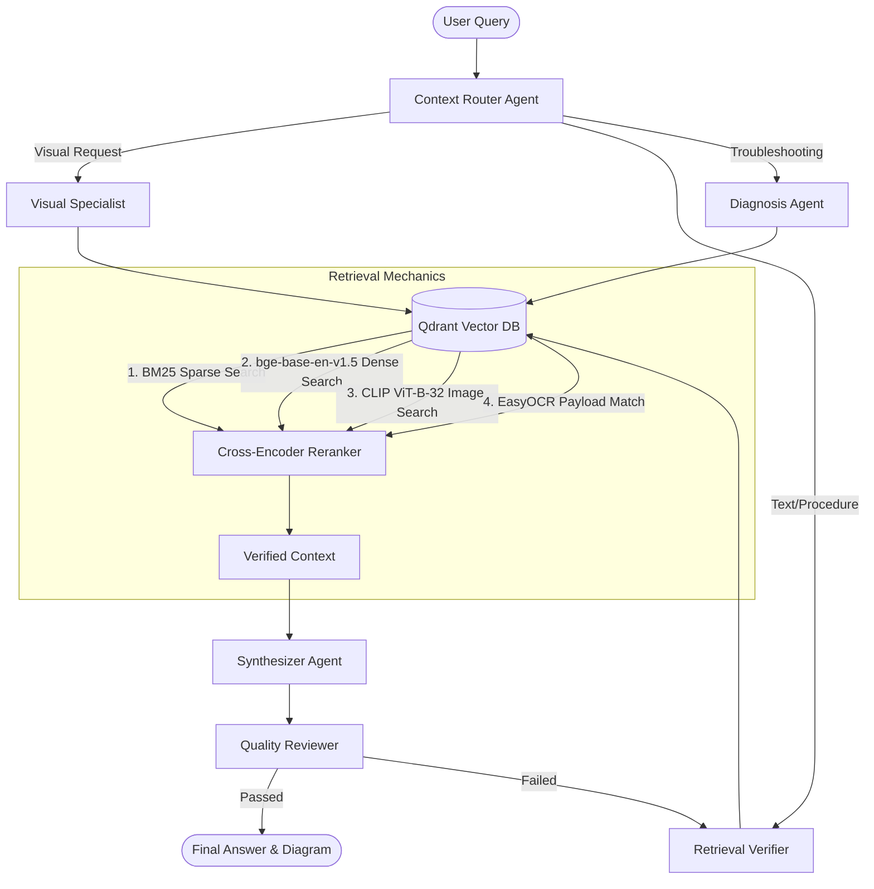

# MaritimeMind AI — Multimodal Engineering Copilot

MaritimeMind AI is an advanced offline-capable RAG (Retrieval-Augmented Generation) system built for the maritime engineering domain. It digests technical manuals, parses complex engineering schematics, and provides an expert conversational interface to troubleshoot shipboard systems.

This system was built as an **academic/professional showcase** demonstrating advanced AI engineering concepts, multi-agent orchestration, and multimodal retrieval on local hardware.

---

## 🏗 System Architecture

The core of the system is a **6-Agent LangGraph Orchestrator** which dynamically routes queries, verifies retrieved context, and synthesizes grounded answers.



## ✨ Key Technical Features

* **Multi-Agent Orchestration**: Built with `LangGraph`. Includes specialized agents for routing, visual diagram retrieval, diagnostics, synthesis, and hallucination prevention.
* **Hybrid Multimodal Retrieval**: 
  * Combines dense vector search (`BAAI/bge-base-en-v1.5`), sparse search (`BM25`), and Reciprocal Rank Fusion (`RRF`).
  * Cross-encoder reranking (`ms-marco-MiniLM-L-12-v2`) guarantees context relevance.
* **Intelligent Diagram Search**: 
  * Fuses `CLIP` visual embeddings with `EasyOCR` text extraction and semantic page-proximity grouping to find the exact engineering schematic needed.
* **Enterprise-Grade Stability**: Includes Redis caching for 100ms response times on repeated queries, JWT authentication, and rate limiting.
* **Modern UI**: A responsive, React-based (Vite + Tailwind) chat interface with markdown rendering, streaming responses, and zoomable interactive schematics.

---

## 🚀 Running the Local Demo

The system runs entirely locally using `docker-compose` for infrastructure and `Ollama` for local LLM inference.

### 1. Start the Local Infrastructure
Includes Qdrant (Vector DB), Redis (Caching), and Arize Phoenix (Observability).
```bash
docker-compose up -d vector-db cache observability
```

### 2. Start the Backend API (FastAPI)
```bash
python -m venv .venv
source .venv/bin/activate  # or .venv\Scripts\activate on Windows
pip install -r requirements.txt
uvicorn app.api.main:app --host 0.0.0.0 --port 8000
```

### 3. Start the Frontend (React / Vite)
```bash
cd frontend
npm install
npm run dev
```

### 4. (Optional) Pre-cache Demo Queries
To ensure instantaneous responses during live demonstrations:
```bash
python scripts/precache.py --username admin --password password
```

## 📚 Built With

* **Backend**: FastAPI, LangChain, LangGraph, Qdrant, Redis
* **AI Models**: Llama 3 (via Ollama), BAAI BGE-Base, CLIP ViT-B-32, MS-Marco Reranker
* **Frontend**: React, Vite, TailwindCSS, Lucide-React
* **Data Processing**: PyMuPDF, pdfplumber, EasyOCR, tiktoken
