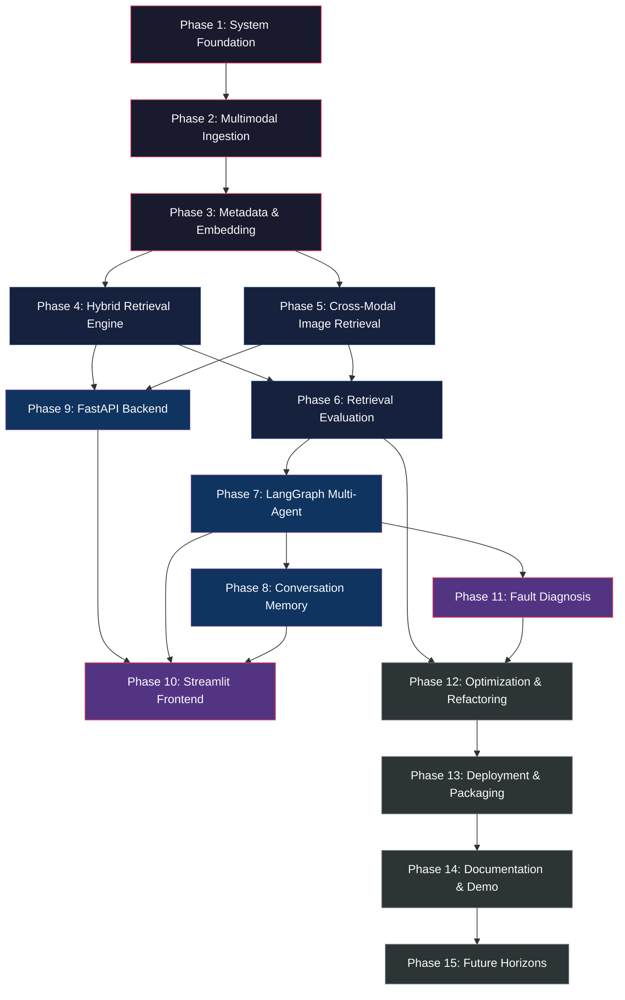

# MaritimeMind AI — Master Development Roadmap

> **Version**: 1.0.0 | **Status**: Planning Complete | **Classification**: Open-Source
> **Last Updated**: 2026-05-22 | **Architecture Reference**: [system_architecture.md](file:///c:/ai_chatbot/maritimemind-ai/docs/system_architecture.md)

---

## Executive Summary

This document is the **complete phase-by-phase engineering execution blueprint** for MaritimeMind AI — an offline-capable, multimodal maritime intelligence platform. It translates the system architecture into an ordered, dependency-aware implementation plan optimized for iterative AI-assisted development (Claude Code / Antigravity / vibe coding workflows).

The roadmap is organized around one core principle: **retrieval quality before interface polish**. The system's value proposition — returning accurate text *and* relevant engineering diagrams from a maritime knowledge base — depends entirely on the quality of ingestion, metadata, embedding, and retrieval. No amount of frontend polish or agent complexity compensates for bad retrieval.

### Roadmap Philosophy

```
┌─────────────────────────────────────────────────────────────────────┐
│                     IMPLEMENTATION PYRAMID                          │
│                                                                     │
│                          ┌───────────┐                              │
│                          │   UI &    │  ← Built LAST                │
│                          │   Demo    │                              │
│                       ┌──┴───────────┴──┐                           │
│                       │   Agents &      │  ← Built AFTER retrieval  │
│                       │   Orchestration │     is proven              │
│                    ┌──┴─────────────────┴──┐                        │
│                    │   Retrieval &         │  ← Core engine          │
│                    │   Evaluation          │                         │
│                 ┌──┴──────────────────────┴──┐                      │
│                 │   Embeddings &             │  ← Quality-critical   │
│                 │   Metadata                 │     layer              │
│              ┌──┴───────────────────────────┴──┐                    │
│              │   Ingestion Pipeline            │  ← Foundation       │
│           ┌──┴────────────────────────────────┴──┐                  │
│           │   System Foundation & Config          │  ← Built FIRST   │
│           └──────────────────────────────────────┘                  │
└─────────────────────────────────────────────────────────────────────┘
```

### Phase Dependency Graph



### Complexity & Timeline Summary

| Phase | Name | Estimated Complexity | Critical Path | Dependencies |
|:---:|:---|:---:|:---:|:---|
| 1 | System Foundation | 🟢 Low | ✅ Yes | None |
| 2 | Multimodal Ingestion Pipeline | 🔴 High | ✅ Yes | Phase 1 |
| 3 | Metadata & Embedding System | 🔴 High | ✅ Yes | Phase 2 |
| 4 | Hybrid Retrieval Engine | 🔴 High | ✅ Yes | Phase 3 |
| 5 | Cross-Modal Image Retrieval | 🟠 Medium-High | ✅ Yes | Phase 3 |
| 6 | Retrieval Evaluation System | 🟠 Medium | ✅ Yes | Phase 4, 5 |
| 7 | LangGraph Multi-Agent Orchestration | 🔴 High | ✅ Yes | Phase 6 |
| 8 | Conversation Memory | 🟡 Medium | ❌ No | Phase 7 |
| 9 | FastAPI Backend | 🟡 Medium | ✅ Yes | Phase 4, 5 |
| 10 | Streamlit Frontend | 🟡 Medium | ❌ No | Phase 7, 8, 9 |
| 11 | Fault Diagnosis Workflows | 🟠 Medium-High | ❌ No | Phase 7 |
| 12 | Optimization & Refactoring | 🟡 Medium | ❌ No | Phase 6, 11 |
| 13 | Deployment & Packaging | 🟡 Medium | ❌ No | Phase 12 |
| 14 | Documentation & Demo | 🟢 Low | ❌ No | Phase 13 |
| 15 | Future Horizons & Capabilities | 🟡 Medium | ❌ No | Phase 14 |

---

## PHASE 1 — System Foundation

### Phase Goal

Establish a rock-solid, fully configured project skeleton with centralized configuration, typed data contracts, logging infrastructure, and a repeatable development environment — so that all subsequent phases write code into a clean, predictable, well-documented structure.

### Why This Phase Exists

> Every production system failure can be traced back to a shortcut taken in the foundation. MaritimeMind AI will be extended by multiple developers (human and AI) over months. Without typed schemas, centralized config, and disciplined structure *from day one*, the codebase will accumulate technical debt exponentially.

Skipping this phase — or doing it hastily — creates three specific failure modes:
1. **Config drift**: Hardcoded paths, model names, and thresholds scattered across files become impossible to manage when tuning retrieval quality.
2. **Schema drift**: Without Pydantic contracts, upstream changes in ingestion silently break downstream retrieval — often discovered only at demo time.
3. **Log blindness**: Without structured logging, debugging ingestion failures on hundreds of pages becomes guesswork.

### Technical Objectives

- [x] Scaffold directory structure (already exists)
- [ ] Implement centralized `pydantic-settings` configuration
- [ ] Define all core Pydantic data models (schemas)
- [ ] Build centralized logging factory with file rotation
- [ ] Configure `.env` for local-first operation (no paid APIs)
- [ ] Set up `pyproject.toml` or finalize `requirements.txt` with pinned versions
- [ ] Initialize `pytest` test framework with fixtures
- [ ] Create CLI entry points (stubs) for ingestion and evaluation

### Architecture Decisions

| Decision | Choice | Rationale |
|:---|:---|:---|
| Config management | `pydantic-settings` with `.env` | Type-safe, validated, environment-aware. Single source of truth. |
| Data contracts | Pydantic `BaseModel` | Runtime validation, JSON serialization, IDE autocomplete. Catches bugs at boundaries. |
| Logging | Python `logging` + `RotatingFileHandler` | Lightweight, no external dependency. 10MB rotation, 30 backups. |
| ID generation | SHA-256 of content + context | Deterministic, collision-resistant, enables idempotent re-ingestion. |
| Package management | `requirements.txt` with pinned versions | Simplicity. No poetry/pipenv complexity for an offline system. |
| Test framework | `pytest` with `conftest.py` fixtures | Industry standard. Parametrize-friendly for evaluation benchmarks. |

### Dependencies

- Python 3.10+
- `pydantic >= 2.0`, `pydantic-settings >= 2.0`
- `python-dotenv`
- `pytest`
- No external services required

### Granular Subphases

#### 1.1 — Environment Configuration

| Task | Target File | Description |
|:---|:---|:---|
| 1.1.1 | `app/configs/__init__.py` | Export config singleton |
| 1.1.2 | `app/configs/config.py` | Implement `MaritimeMindSettings(BaseSettings)` with all project-wide configuration |
| 1.1.3 | `.env` | Update to match config fields: `OLLAMA_BASE_URL`, `OLLAMA_MODEL`, `EMBEDDING_MODEL`, `CLIP_MODEL`, `CHROMADB_PATH`, `DEVICE`, `CHUNK_SIZE`, `CHUNK_OVERLAP`, etc. |
| 1.1.4 | `requirements.txt` | Pin all dependency versions |

**Config fields to define:**

```
# LLM
OLLAMA_BASE_URL: str = "http://localhost:11434"
OLLAMA_MODEL: str = "llama3:8b"

# Embedding Models
TEXT_EMBEDDING_MODEL: str = "all-MiniLM-L6-v2"
CLIP_MODEL_NAME: str = "ViT-B-32"
CLIP_PRETRAINED: str = "laion2b_s34b_b79k"

# Chunking
CHUNK_SIZE: int = 512
CHUNK_OVERLAP: int = 64
MIN_CHUNK_LENGTH: int = 50

# Image Extraction
MIN_IMAGE_WIDTH: int = 100
MIN_IMAGE_HEIGHT: int = 100

# ChromaDB
CHROMADB_PERSIST_DIR: str = "./vector_store/chromadb"
TEXT_COLLECTION_NAME: str = "maritime_text_chunks"
IMAGE_COLLECTION_NAME: str = "maritime_image_chunks"

# BM25
BM25_INDEX_PATH: str = "./vector_store/bm25_index.pkl"

# Retrieval
TOP_K_RESULTS: int = 10
RRF_K: int = 60
CONFIDENCE_THRESHOLD: float = 0.6

# Paths
DATA_DIR: str = "./data"
RAW_PDF_DIR: str = "./data/raw_pdfs"
EXTRACTED_TEXT_DIR: str = "./data/extracted_text"
EXTRACTED_IMAGES_DIR: str = "./data/extracted_images"
PROCESSED_CHUNKS_DIR: str = "./data/processed_chunks"
METADATA_DIR: str = "./data/metadata"

# Logging
LOG_FILE: str = "./logs/maritimemind.log"
LOG_LEVEL: str = "INFO"
LOG_MAX_BYTES: int = 10_485_760  # 10MB
LOG_BACKUP_COUNT: int = 30

# Device
DEVICE: str = "cpu"  # "cpu" or "cuda"
```

#### 1.2 — Pydantic Data Schemas

| Task | Target File | Description |
|:---|:---|:---|
| 1.2.1 | `app/models/__init__.py` | Export all schemas |
| 1.2.2 | `app/models/schemas.py` | Define `TextChunk`, `ImageMetadata`, `BoundingBox`, `RetrievalResult`, `RetrievalScores`, `IngestionManifestEntry`, `QueryIntent` (enum), `AgentState`, `ChatMessage` |

**Schema contracts** (from architecture document §8):

- `TextChunk`: chunk_id, manual_name, ship_id, language, department, page_number, section_title, content, keywords, related_images, hierarchy_path, previous_chunk_id, next_chunk_id, embedding_model, created_at
- `ImageMetadata`: image_id, manual_name, ship_id, language, page_number, image_path, caption, bbox, linked_chunks, ocr_text, embedding_model, created_at
- `BoundingBox`: x0, y0, x1, y1
- `RetrievalScores`: bm25_score, vector_score, rerank_score, final_score, confidence_score
- `RetrievalResult`: chunk (TextChunk), scores (RetrievalScores), images (List[ImageMetadata])
- `QueryIntent`: Enum — EXPLANATION, PROCEDURE, TROUBLESHOOTING, DIAGRAM_REQUEST, EMERGENCY, SOP_LOOKUP
- `IngestionManifestEntry`: status, processed_date, chunk_count, image_count, errors

#### 1.3 — Logging Infrastructure

| Task | Target File | Description |
|:---|:---|:---|
| 1.3.1 | `app/utils/__init__.py` | Export logger factory |
| 1.3.2 | `app/utils/logger.py` | Implement `setup_logger(name: str) -> logging.Logger` with consistent format, file rotation, console output |

**Log format**: `%(asctime)s - %(name)s - %(levelname)s - %(message)s`

#### 1.4 — Test Framework Foundation

| Task | Target File | Description |
|:---|:---|:---|
| 1.4.1 | `tests/conftest.py` | Create shared fixtures: `tmp_data_dir`, `sample_pdf_path`, `mock_config` |
| 1.4.2 | `tests/test_config.py` | Test config loads from `.env`, validates types, uses defaults |
| 1.4.3 | `tests/test_schemas.py` | Test schema instantiation, serialization, validation |

#### 1.5 — CLI Entry Point Stubs

| Task | Target File | Description |
|:---|:---|:---|
| 1.5.1 | `scripts/ingest.py` | Stub: parse CLI args (pdf_dir, single file), import pipeline, call `run_ingestion()` |
| 1.5.2 | `scripts/evaluate.py` | Stub: parse CLI args, import evaluation runner, call `run_evaluation()` |
| 1.5.3 | `app/__init__.py` | Set package-level `__version__` |

### Recommended Implementation Order

```
1.1.2 (config.py) → 1.1.3 (.env) → 1.1.4 (requirements.txt)
         ↓
1.2.2 (schemas.py)
         ↓
1.3.2 (logger.py)
         ↓
1.4.1 (conftest.py) → 1.4.2 (test_config) → 1.4.3 (test_schemas)
         ↓
1.5.1 (ingest.py) → 1.5.2 (evaluate.py)
```

### Deliverables

- [ ] `app/configs/config.py` — Fully typed, validated, documented configuration
- [ ] `app/models/schemas.py` — All data contracts with docstrings
- [ ] `app/utils/logger.py` — Logging factory
- [ ] `tests/conftest.py` — Test fixtures
- [ ] `tests/test_config.py` — Config tests
- [ ] `tests/test_schemas.py` — Schema tests
- [ ] `scripts/ingest.py` — CLI stub
- [ ] `scripts/evaluate.py` — CLI stub
- [ ] Updated `.env`, `requirements.txt`

### Verification Checklist

- [ ] `python -c "from app.configs.config import settings; print(settings.OLLAMA_MODEL)"` succeeds
- [ ] `python -c "from app.models.schemas import TextChunk; print(TextChunk.model_fields.keys())"` succeeds
- [ ] `pytest tests/test_config.py tests/test_schemas.py -v` — all pass
- [ ] Config loads from `.env` with correct types
- [ ] Logger creates `logs/maritimemind.log` on first call
- [ ] Schema serialization round-trips (model → JSON → model)

### Testing Checklist

| Test | Type | Validates |
|:---|:---|:---|
| Config loads defaults | Unit | Default values applied when `.env` missing |
| Config validates types | Unit | Invalid values raise `ValidationError` |
| Schema instantiation | Unit | All required fields enforced |
| Schema JSON round-trip | Unit | `model_dump_json()` → `model_validate_json()` |
| Logger file creation | Integration | Log file created and written |
| Logger rotation | Integration | File rolls over at size threshold |

### Common Failure Cases

| Failure | Cause | Prevention |
|:---|:---|:---|
| `ModuleNotFoundError` on imports | Missing `__init__.py` files | Ensure every package dir has `__init__.py` |
| Pydantic validation errors | Schema fields mistyped | Use `Optional[]` for nullable fields, set `default=None` |
| `.env` not found | Wrong working directory | Use `env_file` with relative path, document expected CWD |
| Log directory missing | First run | `setup_logger()` should `os.makedirs(log_dir, exist_ok=True)` |

### Refactor Risks

🟢 **Low**. This phase creates interfaces, not implementations. Schemas may gain fields later, but Pydantic handles forward-compatible evolution well.

### Scalability Concerns

None. Configuration and schemas are inherently lightweight.

### Future Compatibility

- Config fields for `RERANKER_MODEL`, `OCR_ENABLED`, `NEO4J_URI` should be added as stubs (commented or with `Optional[str] = None`) to avoid config refactoring later.
- Schemas should include `model_config = ConfigDict(extra="allow")` during early development to tolerate evolving fields.

### Recommended Git Commit Strategy

```
commit 1: "feat(config): Add centralized pydantic-settings configuration"
commit 2: "feat(schemas): Define all core Pydantic data models"
commit 3: "feat(logging): Add centralized logging factory with file rotation"
commit 4: "test(foundation): Add config and schema unit tests"
commit 5: "feat(cli): Add ingestion and evaluation CLI entry point stubs"
```

### Estimated Complexity

🟢 **Low** — ~300–500 lines of code. 1–2 focused sessions.

### Recommended Folder Targets

```
app/configs/config.py          ← NEW
app/models/schemas.py          ← NEW
app/utils/logger.py            ← NEW
tests/conftest.py              ← NEW
tests/test_config.py           ← NEW
tests/test_schemas.py          ← NEW
scripts/ingest.py              ← UPDATE (from stub)
scripts/evaluate.py            ← UPDATE (from stub)
.env                           ← UPDATE
requirements.txt               ← UPDATE
```

### What NOT To Build Yet

> [!CAUTION]
> - ❌ Do NOT implement any PDF parsing logic
> - ❌ Do NOT install or configure Ollama
> - ❌ Do NOT create embedding service implementations
> - ❌ Do NOT set up ChromaDB collections
> - ❌ Do NOT create any API routes
> - ❌ Do NOT create any agent definitions
> - ❌ Do NOT build UI components

---

## PHASE 2 — Multimodal Ingestion Pipeline

### Phase Goal

Build a robust, layout-aware PDF ingestion pipeline that extracts text blocks, tables, and images from maritime technical manuals — preserving structural hierarchy, spatial relationships, and procedural integrity — and produces clean, typed data objects ready for embedding.

### Why This Phase Exists

> Ingestion quality is the **single most important determinant** of final system quality. If text is extracted poorly, chunked carelessly, or images are missed, no amount of retrieval sophistication or agent intelligence can recover. This is the "garbage in, garbage out" boundary.

Maritime PDFs are uniquely challenging:
- Dense multi-column layouts with mixed text, tables, and diagrams
- Complex heading hierarchies (Chapter → Section → Subsection → Procedure → Step)
- Inline engineering schematics that must be extracted and linked to nearby text
- Tables of specifications, fault codes, and parameters that must never be split mid-row
- Numbered procedural steps that must never be split mid-procedure (safety risk)

### Technical Objectives

- [ ] Parse PDFs using PyMuPDF (primary) + pdfplumber (tables)
- [ ] Extract text blocks with font metadata (size, weight, flags)
- [ ] Detect heading hierarchy using font-size thresholds
- [ ] Extract tables and convert to Markdown format
- [ ] Extract images with bounding boxes, apply size filters
- [ ] Implement layout-aware chunking with hierarchy tracking
- [ ] Build text-image spatial association engine
- [ ] Generate deterministic chunk IDs (SHA-256)
- [ ] Build doubly-linked chunk chains (previous/next)
- [ ] Write ingestion manifest for tracking
- [ ] Create OCR service interface stub

### Architecture Decisions

| Decision | Choice | Rationale |
|:---|:---|:---|
| Primary PDF parser | PyMuPDF (`fitz`) | Superior layout analysis, character-level bounding boxes, direct image extraction. Most mature Python PDF library. |
| Table parser | pdfplumber | Cell-boundary detection superior to PyMuPDF for complex maritime tables. Used complementarily on flagged pages only. |
| Chunking strategy | Layout-aware with hierarchy | Token-based splitting destroys procedural integrity. Maritime manuals require structure-preserving chunking. |
| Image extraction | PyMuPDF `get_images()` + size filter | Filters decorative elements. Preserves bounding box for spatial association. |
| Chunk ID strategy | SHA-256(content + manual_name + page) | Deterministic enables idempotent re-ingestion without duplicates. |
| Table handling | Keep whole, never split | Splitting a fault code table mid-row produces dangerous incomplete data. |
| Procedure handling | Keep whole or split at step boundaries | Never split mid-step. Safety-critical. |

### Dependencies

- **Phase 1** must be complete (config, schemas, logger)
- `pymupdf (fitz)`, `pdfplumber`, `pillow`
- At least one sample maritime PDF in `data/raw_pdfs/`

### Granular Subphases

#### 2.1 — PDF Parser Service

| Task | Target File | Description |
|:---|:---|:---|
| 2.1.1 | `app/services/pdf_parser.py` | Implement `PdfParserService` class |
| 2.1.2 | — | Method: `parse_pdf(pdf_path: str) -> ParsedDocument` |
| 2.1.3 | — | Method: `_extract_text_blocks(page) -> List[TextBlock]` — extract text with font metadata |
| 2.1.4 | — | Method: `_extract_tables(page) -> List[str]` — use pdfplumber, convert to Markdown |
| 2.1.5 | — | Method: `_extract_images(page, pdf_path) -> List[RawImage]` — extract, filter, save to disk |
| 2.1.6 | — | Method: `_detect_headings(text_blocks) -> List[HeadingInfo]` — classify by font size thresholds |
| 2.1.7 | — | Method: `_find_caption(image_bbox, text_blocks) -> Optional[str]` — spatial proximity caption search |

**Intermediate data models** (internal to parser, not in `schemas.py`):

```python
@dataclass
class TextBlock:
    text: str
    font_size: float
    font_flags: int  # bold, italic
    bbox: Tuple[float, float, float, float]
    page_number: int

@dataclass
class RawImage:
    image_bytes: bytes
    bbox: Tuple[float, float, float, float]
    page_number: int
    xref: int  # PyMuPDF internal ref

@dataclass
class ParsedPage:
    page_number: int
    text_blocks: List[TextBlock]
    tables: List[str]  # Markdown
    images: List[RawImage]

@dataclass
class ParsedDocument:
    manual_name: str
    pages: List[ParsedPage]
    total_images_extracted: int
    total_tables_extracted: int
```

#### 2.2 — Layout-Aware Chunker Service

| Task | Target File | Description |
|:---|:---|:---|
| 2.2.1 | `app/services/chunker.py` | Implement `ChunkerService` class |
| 2.2.2 | — | Method: `chunk_document(parsed_doc: ParsedDocument) -> List[TextChunk]` |
| 2.2.3 | — | Method: `_build_hierarchy(headings: List[HeadingInfo]) -> List[str]` — maintain hierarchy_path stack |
| 2.2.4 | — | Method: `_split_with_overlap(text: str, chunk_size: int, overlap: int) -> List[str]` — respects sentence boundaries |
| 2.2.5 | — | Method: `_is_procedure(text: str) -> bool` — detect numbered steps |
| 2.2.6 | — | Method: `_is_table(text: str) -> bool` — detect Markdown table content |
| 2.2.7 | — | Method: `_generate_chunk_id(content: str, manual_name: str, page: int) -> str` — SHA-256 |
| 2.2.8 | — | Method: `_link_chunks(chunks: List[TextChunk]) -> List[TextChunk]` — set previous/next IDs |

**Chunking rules:**

```
IF block is a table:
    → Keep entire table as one chunk (never split)
    → Prepend table's section heading for context

IF block is a numbered procedure:
    → Keep entire procedure as one chunk
    → If exceeds 2x CHUNK_SIZE, split at step boundaries only

IF block is body text:
    → Split at CHUNK_SIZE with CHUNK_OVERLAP
    → Split at sentence boundaries (prefer period + space)
    → Never split mid-sentence

IF block is a heading:
    → Push to hierarchy_path stack
    → Do not create a chunk from heading alone
    → Prepend to next body text chunk

ALWAYS:
    → Set hierarchy_path from current heading stack
    → Set section_title from immediate parent heading
    → Generate chunk_id from SHA-256(content + manual_name + page_number)
```

#### 2.3 — Image Extraction & Storage Service

| Task | Target File | Description |
|:---|:---|:---|
| 2.3.1 | `app/services/image_extractor.py` | Implement `ImageExtractorService` class |
| 2.3.2 | — | Method: `extract_and_save(parsed_doc: ParsedDocument) -> List[ImageMetadata]` |
| 2.3.3 | — | Method: `_save_image(image_bytes: bytes, manual_name: str, image_id: str) -> str` — save PNG, return path |
| 2.3.4 | — | Method: `_generate_image_id(image_bytes: bytes) -> str` — SHA-256 of raw bytes |
| 2.3.5 | — | Method: `_filter_decorative(width: int, height: int) -> bool` — apply MIN_IMAGE_WIDTH/HEIGHT |
| 2.3.6 | — | Method: `_deduplicate(image_id: str, manifest: dict) -> bool` — check if already processed |

#### 2.4 — Text-Image Association Engine

| Task | Target File | Description |
|:---|:---|:---|
| 2.4.1 | `app/services/association.py` | Implement `AssociationEngine` class |
| 2.4.2 | — | Method: `associate(chunks: List[TextChunk], images: List[ImageMetadata]) -> Tuple[List[TextChunk], List[ImageMetadata]]` |
| 2.4.3 | — | Implement **Spatial Proximity Rule**: image on page N → all chunks from page N |
| 2.4.4 | — | Implement **Textual Reference Rule**: regex for "Figure X", "Diagram X", "see schematic X", "Table X" |
| 2.4.5 | — | Bidirectional linking: `TextChunk.related_images` ↔ `ImageMetadata.linked_chunks` |

**Regex patterns for textual reference detection:**

```python
FIGURE_PATTERNS = [
    r"(?:Figure|Fig\.?|Diagram|Schematic|Drawing|Chart|Illustration)\s*[\d\w][\d\w\-\.]*",
    r"(?:see|refer\s+to|as\s+shown\s+in)\s+(?:Figure|Fig\.?|Diagram)\s*[\d\w][\d\w\-\.]*",
    r"(?:Table)\s*[\d\w][\d\w\-\.]*",
]
```

#### 2.5 — Ingestion Manifest System

| Task | Target File | Description |
|:---|:---|:---|
| 2.5.1 | `app/services/manifest.py` | Implement `IngestionManifest` class |
| 2.5.2 | — | Method: `load() -> dict` — load from JSON file or return empty dict |
| 2.5.3 | — | Method: `update(manual_name, status, chunk_count, image_count, errors)` |
| 2.5.4 | — | Method: `is_processed(manual_name: str) -> bool` |
| 2.5.5 | — | Method: `save()` — write JSON to `data/metadata/ingestion_manifest.json` |

#### 2.6 — OCR Service Stub

| Task | Target File | Description |
|:---|:---|:---|
| 2.6.1 | `app/services/ocr.py` | Implement `OcrService` interface |
| 2.6.2 | — | Method: `extract(image_path: str) -> str` — returns `""` for now |
| 2.6.3 | — | Docstring: explains future Tesseract / Vision LLM integration |

#### 2.7 — Ingestion Pipeline Orchestrator

| Task | Target File | Description |
|:---|:---|:---|
| 2.7.1 | `app/ingestion/pipeline.py` | Implement `IngestionPipeline` class |
| 2.7.2 | — | Method: `run(pdf_path: str) -> IngestionResult` — orchestrate full pipeline |
| 2.7.3 | — | Method: `run_directory(pdf_dir: str) -> List[IngestionResult]` — batch processing |
| 2.7.4 | — | Wire: parser → chunker → image extractor → association → manifest |
| 2.7.5 | `scripts/ingest.py` | Update CLI to call `IngestionPipeline.run_directory()` |

### Recommended Implementation Order

```
2.1 (PDF Parser) → 2.3 (Image Extractor) → 2.2 (Chunker) → 2.4 (Association)
                                                                       ↓
2.5 (Manifest) → 2.6 (OCR Stub) → 2.7 (Pipeline Orchestrator)
```

> [!IMPORTANT]
> Build the PDF parser **first** and test it in isolation with a real maritime PDF before building the chunker. Parser bugs propagate invisibly through every downstream component.

### Deliverables

- [ ] `app/services/pdf_parser.py` — PDF parsing with text, table, and image extraction
- [ ] `app/services/chunker.py` — Layout-aware, hierarchy-preserving chunker
- [ ] `app/services/image_extractor.py` — Image extraction, dedup, storage
- [ ] `app/services/association.py` — Text-image bidirectional association
- [ ] `app/services/manifest.py` — Ingestion tracking manifest
- [ ] `app/services/ocr.py` — OCR interface stub
- [ ] `app/ingestion/pipeline.py` — Pipeline orchestrator
- [ ] `scripts/ingest.py` — Updated CLI entry point
- [ ] Sample ingestion output in `data/` directories

### Verification Checklist

- [ ] `python scripts/ingest.py --pdf data/raw_pdfs/sample_manual.pdf` completes without errors
- [ ] `data/extracted_images/{manual_name}/` contains extracted PNGs
- [ ] `data/metadata/ingestion_manifest.json` shows `status: COMPLETED`
- [ ] All chunks have valid `chunk_id`, `hierarchy_path`, `page_number`
- [ ] Tables are never split mid-row (manual inspection of chunks)
- [ ] Numbered procedures are never split mid-step
- [ ] Images are linked bidirectionally to relevant chunks
- [ ] Re-running ingestion on same PDF does not create duplicate chunks
- [ ] Decorative/small images are filtered out

### Testing Checklist

| Test | Type | Validates |
|:---|:---|:---|
| Parse single-page PDF | Unit | Text extraction from simple page |
| Parse multi-column PDF | Unit | Column handling doesn't interleave text |
| Extract tables to Markdown | Unit | Table structure preserved |
| Extract images with bbox | Unit | Images saved, bbox correct |
| Filter small images | Unit | Images below threshold excluded |
| Chunk with hierarchy | Unit | hierarchy_path reflects heading structure |
| Chunk size limits | Unit | No chunk exceeds 2x CHUNK_SIZE |
| Table kept whole | Unit | Table content never split |
| Procedure kept whole | Unit | Numbered steps never split mid-step |
| Association spatial | Unit | Image on page N linked to page N chunks |
| Association textual | Unit | "Figure 3" reference correctly linked |
| Bidirectional linking | Unit | TextChunk.related_images ↔ ImageMetadata.linked_chunks |
| Manifest idempotency | Integration | Re-ingestion skips completed files |
| End-to-end pipeline | Integration | Full PDF → chunks + images + manifest |

### Common Failure Cases

| Failure | Cause | Prevention |
|:---|:---|:---|
| Empty text extraction | Scanned PDF (image-only) | Log warning, mark for OCR pipeline. Don't fail silently. |
| Garbled text | Non-standard font encodings | Try `fitz.Page.get_text("text")` fallback. Log and flag. |
| Missing images | Images embedded as vector graphics | PyMuPDF `get_drawings()` as future enhancement. Log count. |
| Heading detection failure | Inconsistent fonts across manuals | Make heading thresholds configurable per-manual in config |
| Table detection failure | Tables without visible borders | pdfplumber `table_settings` tuning. Log undetected tables. |
| Memory explosion | Very large PDFs (1000+ pages) | Process page-by-page, not all-at-once. Stream to disk. |
| Image dedup collision | SHA-256 collision (theoretical) | Include page number in hash input as secondary discriminator |

### Refactor Risks

🟠 **Medium**. The chunking strategy is the most likely component to require iteration. Initial heading detection thresholds may need manual tuning per-manual-type. Design the chunker with pluggable heading detection.

### Scalability Concerns

- Page-by-page processing: essential for large manuals (1000+ pages). Never load all pages into memory.
- Image extraction: write to disk immediately, don't accumulate in memory.
- Batch ingestion: process one PDF at a time, not all concurrently (disk I/O bound).

### Future Compatibility

- OCR stub is pre-wired for Tesseract/LLaVA integration.
- Association engine should accept pluggable rules (spatial, textual, semantic) for future vision-model-based matching.
- Chunking should expose a strategy pattern for future domain-specific chunkers.

### Recommended Git Commit Strategy

```
commit 1: "feat(parser): Implement PDF text and layout extraction with PyMuPDF"
commit 2: "feat(parser): Add table extraction with pdfplumber Markdown conversion"
commit 3: "feat(images): Implement image extraction, filtering, and storage"
commit 4: "feat(chunker): Implement layout-aware hierarchical chunking"
commit 5: "feat(association): Build text-image bidirectional association engine"
commit 6: "feat(manifest): Add ingestion manifest for tracking and idempotency"
commit 7: "feat(pipeline): Wire ingestion pipeline orchestrator"
commit 8: "test(ingestion): Add comprehensive ingestion pipeline tests"
```

### Estimated Complexity

🔴 **High** — ~1000–1500 lines of code. This is the most critical phase. Budget 3–5 focused sessions. Test extensively with real PDFs.

### Recommended Folder Targets

```
app/services/pdf_parser.py       ← NEW
app/services/chunker.py          ← NEW
app/services/image_extractor.py  ← NEW
app/services/association.py      ← NEW
app/services/manifest.py         ← NEW
app/services/ocr.py              ← NEW
app/ingestion/__init__.py        ← NEW
app/ingestion/pipeline.py        ← NEW
tests/ingestion/test_parser.py   ← NEW
tests/ingestion/test_chunker.py  ← NEW
tests/ingestion/test_pipeline.py ← NEW
```

### What NOT To Build Yet

> [!CAUTION]
> - ❌ Do NOT generate embeddings — that is Phase 3
> - ❌ Do NOT store anything in ChromaDB — that is Phase 3
> - ❌ Do NOT build BM25 indexes — that is Phase 4
> - ❌ Do NOT implement OCR — only the interface stub
> - ❌ Do NOT implement caption generation via LLM
> - ❌ Do NOT build any retrieval logic
> - ❌ Do NOT optimize for speed — optimize for correctness

---

## PHASE 3 — Metadata & Embedding System

### Phase Goal

Transform the raw extracted data (text chunks and images) from Phase 2 into high-quality vector embeddings stored in ChromaDB, with rich metadata preserved for filtering, citation, and cross-modal retrieval. This phase bridges ingestion and retrieval.

### Why This Phase Exists

> Embeddings are the semantic representation layer. Poor embeddings = poor retrieval = useless system. This phase must get two critical things right:
> 1. **Text embeddings** that capture maritime technical semantics
> 2. **Image embeddings** that enable text-to-image cross-modal search
>
> These must be stored with **complete metadata** so that retrieval results can be filtered, cited, and traced back to source pages.

### Technical Objectives

- [ ] Implement SentenceTransformers text embedding service
- [ ] Implement OpenCLIP image embedding service
- [ ] Initialize ChromaDB with two persistent collections
- [ ] Store text chunks with full metadata in `maritime_text_chunks` collection
- [ ] Store image embeddings with metadata in `maritime_image_chunks` collection
- [ ] Build BM25 sparse index from text corpus
- [ ] Implement batch embedding with progress tracking
- [ ] Wire embedding into ingestion pipeline

### Architecture Decisions

| Decision | Choice | Rationale |
|:---|:---|:---|
| Text embedding model | `all-MiniLM-L6-v2` (384-dim) | Lightweight, fast on CPU, strong semantic similarity. Ideal for offline deployment. |
| Image embedding model | OpenCLIP `ViT-B-32` / `laion2b_s34b_b79k` (512-dim) | Jointly trained with text — enables cross-modal query. LAION pretraining is broadly capable. |
| Vector store | ChromaDB (embedded, persistent) | Zero-server, file-based. Perfect for offline deployment. Future migration path to Milvus/pgvector. |
| BM25 implementation | `rank-bm25` | Pure Python, no external service. Serializable with pickle. |
| Embedding batch size | Configurable (default 32) | Balances memory usage vs. throughput on CPU. |

### Dependencies

- **Phase 2** must be complete (ingestion pipeline producing `TextChunk` and `ImageMetadata`)
- `sentence-transformers`, `open-clip-torch`, `chromadb`, `rank-bm25`
- Sufficient disk space for model weights (~500MB first download)

### Granular Subphases

#### 3.1 — Text Embedding Service

| Task | Target File | Description |
|:---|:---|:---|
| 3.1.1 | `app/services/embedding.py` | Implement `TextEmbeddingService` class |
| 3.1.2 | — | Method: `__init__()` — lazy-load SentenceTransformer model |
| 3.1.3 | — | Method: `embed_text(text: str) -> List[float]` — single text embedding |
| 3.1.4 | — | Method: `embed_batch(texts: List[str]) -> List[List[float]]` — batch with tqdm progress |
| 3.1.5 | — | Method: `embed_query(query: str) -> List[float]` — alias for query-time use |
| 3.1.6 | — | Device routing: use `settings.DEVICE` for CPU/CUDA |

#### 3.2 — Image Embedding Service

| Task | Target File | Description |
|:---|:---|:---|
| 3.2.1 | `app/services/clip_embedding.py` | Implement `ImageEmbeddingService` class |
| 3.2.2 | — | Method: `__init__()` — load OpenCLIP model + preprocessing pipeline |
| 3.2.3 | — | Method: `embed_image(image_path: str) -> List[float]` — single image embedding |
| 3.2.4 | — | Method: `embed_batch(image_paths: List[str]) -> List[List[float]]` — batch processing |
| 3.2.5 | — | Method: `embed_text_for_image_search(query: str) -> List[float]` — encode text query into CLIP space for cross-modal search |
| 3.2.6 | — | Preprocessing: resize, center-crop, normalize per CLIP requirements |

> [!IMPORTANT]
> The `embed_text_for_image_search` method is **critical** for cross-modal retrieval. It uses CLIP's text encoder (not SentenceTransformers) to produce a 512-dim vector in the same space as image embeddings. This is what enables "cooling pump diagram" (text query) → relevant image retrieval.

#### 3.3 — ChromaDB Vector Store Service

| Task | Target File | Description |
|:---|:---|:---|
| 3.3.1 | `app/services/vector_store.py` | Implement `VectorStoreService` class |
| 3.3.2 | — | Method: `__init__()` — initialize ChromaDB client in persistent mode |
| 3.3.3 | — | Method: `_get_or_create_text_collection() -> Collection` |
| 3.3.4 | — | Method: `_get_or_create_image_collection() -> Collection` |
| 3.3.5 | — | Method: `add_text_chunks(chunks: List[TextChunk], embeddings: List[List[float]])` — upsert with full metadata |
| 3.3.6 | — | Method: `add_image_embeddings(images: List[ImageMetadata], embeddings: List[List[float]])` — upsert with metadata |
| 3.3.7 | — | Method: `query_text(embedding: List[float], top_k: int, filters: dict) -> List[dict]` |
| 3.3.8 | — | Method: `query_images(embedding: List[float], top_k: int) -> List[dict]` |
| 3.3.9 | — | Method: `get_collection_stats() -> dict` — counts, dimensionality |
| 3.3.10 | — | Method: `delete_collection(name: str)` — for re-ingestion |

**ChromaDB metadata fields stored with text chunks:**

```python
metadata = {
    "manual_name": chunk.manual_name,
    "ship_id": chunk.ship_id,
    "language": chunk.language,
    "department": chunk.department,
    "page_number": chunk.page_number,
    "section_title": chunk.section_title,
    "hierarchy_path": json.dumps(chunk.hierarchy_path),
    "related_images": json.dumps(chunk.related_images),
    "keywords": json.dumps(chunk.keywords),
    "previous_chunk_id": chunk.previous_chunk_id or "",
    "next_chunk_id": chunk.next_chunk_id or "",
    "embedding_model": chunk.embedding_model,
    "created_at": chunk.created_at,
}
```

#### 3.4 — BM25 Index Builder

| Task | Target File | Description |
|:---|:---|:---|
| 3.4.1 | `app/services/bm25_index.py` | Implement `BM25IndexService` class |
| 3.4.2 | — | Method: `build_index(chunks: List[TextChunk])` — tokenize and build BM25 |
| 3.4.3 | — | Method: `save(path: str)` — pickle serialization |
| 3.4.4 | — | Method: `load(path: str)` — deserialize |
| 3.4.5 | — | Method: `search(query: str, top_k: int) -> List[Tuple[int, float]]` — return (chunk_index, score) |
| 3.4.6 | — | Tokenization: lowercase, split on whitespace/punctuation, remove stopwords |

> [!NOTE]
> BM25 tokenization must be **consistent** between index build time and query time. Use the same tokenizer function for both. Store the tokenizer alongside the index.

#### 3.5 — Wire Embedding into Ingestion Pipeline

| Task | Target File | Description |
|:---|:---|:---|
| 3.5.1 | `app/ingestion/pipeline.py` | Extend `IngestionPipeline` to call embedding services after chunking |
| 3.5.2 | — | After chunks created: embed text → store in ChromaDB text collection |
| 3.5.3 | — | After images extracted: embed images → store in ChromaDB image collection |
| 3.5.4 | — | After all chunks processed: build BM25 index → save to disk |
| 3.5.5 | — | Update manifest with embedding status |

### Recommended Implementation Order

```
3.1 (Text Embedding) → 3.2 (Image Embedding) → 3.3 (ChromaDB Store)
                                                         ↓
                                               3.4 (BM25 Index)
                                                         ↓
                                               3.5 (Pipeline Integration)
```

### Deliverables

- [ ] `app/services/embedding.py` — Text embedding service
- [ ] `app/services/clip_embedding.py` — Image/CLIP embedding service
- [ ] `app/services/vector_store.py` — ChromaDB storage service
- [ ] `app/services/bm25_index.py` — BM25 sparse index service
- [ ] Updated `app/ingestion/pipeline.py` — Full ingestion + embedding pipeline
- [ ] Populated `vector_store/chromadb/` with both collections
- [ ] Serialized `vector_store/bm25_index.pkl`

### Verification Checklist

- [ ] Text embedding produces 384-dim vectors
- [ ] Image embedding produces 512-dim vectors
- [ ] CLIP text embedding produces 512-dim vectors (same space as images)
- [ ] ChromaDB `maritime_text_chunks` collection populated with correct metadata
- [ ] ChromaDB `maritime_image_chunks` collection populated
- [ ] `vector_store.get_collection_stats()` returns correct counts
- [ ] BM25 index serialized and loadable
- [ ] BM25 search returns results for known maritime terms
- [ ] Re-ingestion upserts (no duplicates)
- [ ] Manual metadata inspection: `page_number`, `hierarchy_path`, `related_images` all correct

### Testing Checklist

| Test | Type | Validates |
|:---|:---|:---|
| Text embedding dimensionality | Unit | Output is List[float] of length 384 |
| Image embedding dimensionality | Unit | Output is List[float] of length 512 |
| CLIP text embedding dimensionality | Unit | Output is List[float] of length 512 |
| ChromaDB upsert + query | Integration | Store and retrieve by embedding similarity |
| ChromaDB metadata filtering | Integration | Filter by `manual_name`, `department` |
| BM25 build + search | Unit | Index builds, search returns ranked results |
| BM25 serialize/deserialize | Unit | Saved index loads and produces same results |
| Full pipeline: PDF → ChromaDB | Integration | End-to-end ingestion + embedding + storage |
| Duplicate prevention | Integration | Re-ingestion doesn't create duplicates |

### Common Failure Cases

| Failure | Cause | Prevention |
|:---|:---|:---|
| OOM during embedding | Large batch size on CPU | Set batch size to 32 default, make configurable |
| ChromaDB dimension mismatch | Wrong embedding model loaded | Validate dimensionality before insert. Store model name in metadata. |
| CLIP model download failure | No internet on target machine | Document first-run model download requirement. Cache models locally. |
| BM25 empty results | Tokenizer mismatch between build and query | Share single tokenizer function. Test round-trip. |
| Slow embedding on CPU | Large corpus, no GPU | Add tqdm progress bars. Log ETA. Process incrementally. |

### Refactor Risks

🟡 **Medium**. Embedding model changes require re-indexing the entire corpus. Design for this: the `embedding_model` field in metadata enables version tracking and selective re-embedding.

### Scalability Concerns

- First model load is slow (~5–10s for SentenceTransformers, ~15–30s for OpenCLIP on CPU). Implement lazy loading with singleton pattern.
- For 10,000+ chunks, batch embedding with progress bars is essential for user experience.
- ChromaDB embedded mode may slow on 100K+ documents. Migration path to server mode documented.

### Future Compatibility

- `embedding_model` field enables future model upgrades without full re-indexing (version coexistence).
- `VectorStoreService` interface should be abstractable to support Milvus/pgvector backends.
- Consider `nomic-embed-text` as a future open-source alternative to `all-MiniLM-L6-v2`.

### Recommended Git Commit Strategy

```
commit 1: "feat(embedding): Implement SentenceTransformers text embedding service"
commit 2: "feat(clip): Implement OpenCLIP image embedding service with cross-modal support"
commit 3: "feat(vectorstore): Implement ChromaDB persistent storage with dual collections"
commit 4: "feat(bm25): Implement BM25 sparse index with serialization"
commit 5: "feat(pipeline): Integrate embedding and storage into ingestion pipeline"
commit 6: "test(embedding): Add embedding and vector store tests"
```

### Estimated Complexity

🔴 **High** — ~800–1200 lines of code. OpenCLIP integration requires careful tensor handling. 3–4 focused sessions.

### Recommended Folder Targets

```
app/services/embedding.py        ← NEW
app/services/clip_embedding.py   ← NEW
app/services/vector_store.py     ← NEW
app/services/bm25_index.py       ← NEW
app/ingestion/pipeline.py        ← UPDATE
tests/test_embedding.py          ← NEW
tests/test_vector_store.py       ← NEW
tests/test_bm25.py               ← NEW
```

### What NOT To Build Yet

> [!CAUTION]
> - ❌ Do NOT build the retrieval query pipeline — that is Phase 4
> - ❌ Do NOT implement reranking — that is Phase 4
> - ❌ Do NOT implement RRF fusion — that is Phase 4
> - ❌ Do NOT build cross-modal retrieval logic — that is Phase 5
> - ❌ Do NOT attempt GPU optimization — that is Phase 12
> - ❌ Do NOT implement any evaluation metrics — that is Phase 6

---

## PHASE 4 — Hybrid Retrieval Engine

### Phase Goal

Build the core query-time retrieval engine that combines BM25 keyword search with ChromaDB dense vector search using Reciprocal Rank Fusion (RRF), optionally reranked with a cross-encoder, producing scored and ranked `RetrievalResult` objects with full citations.

### Why This Phase Exists

> Maritime documentation contains both natural language descriptions **and** precise technical codes (e.g., `MAN B&W 6S60MC-C`, `ISO 8217`, `PRO-ENG-0042`). Dense vector search excels at semantic understanding ("what does this procedure involve?") but fails on exact terminology. BM25 excels at exact matches but misses paraphrases. Hybrid search with RRF gives the best of both — this is not optional for maritime domain accuracy.

### Technical Objectives

- [ ] Implement query classification (intent detection)
- [ ] Implement BM25 keyword retrieval
- [ ] Implement ChromaDB dense vector retrieval
- [ ] Implement Reciprocal Rank Fusion (RRF) merger
- [ ] Implement cross-encoder reranking (optional, configurable)
- [ ] Build confidence scoring pipeline
- [ ] Produce structured `RetrievalResult` objects with full metadata
- [ ] Implement metadata-based filtering (manual, department, page range)

### Architecture Decisions

| Decision | Choice | Rationale |
|:---|:---|:---|
| Fusion method | RRF (k=60) | Score-agnostic fusion. No normalization needed. Well-proven in IR literature. |
| Reranker | `cross-encoder/ms-marco-MiniLM-L-6-v2` | Lightweight cross-encoder. Runs on CPU. Strong relevance judgements. |
| Reranking scope | Top-N after RRF (configurable, default 20) | Cross-encoder is expensive. Apply only to best candidates. |
| Intent classification | Rule-based + keyword patterns (initially) | Avoid LLM dependency for classification. Upgrade to LLM-based in Phase 7. |
| Confidence scoring | Normalized weighted average of component scores | Provides threshold for quality gating in agents. |

### Dependencies

- **Phase 3** must be complete (ChromaDB populated, BM25 index built)
- `sentence-transformers` (for CrossEncoder)
- Populated vector store with real maritime data

### Granular Subphases

#### 4.1 — Query Intent Classifier

| Task | Target File | Description |
|:---|:---|:---|
| 4.1.1 | `app/retrieval/query_classifier.py` | Implement `QueryClassifier` class |
| 4.1.2 | — | Method: `classify(query: str) -> QueryIntent` |
| 4.1.3 | — | Rule-based: keyword patterns for each intent type |

**Classification rules (initial):**

```python
INTENT_PATTERNS = {
    QueryIntent.DIAGRAM_REQUEST: [
        r"diagram", r"schematic", r"drawing", r"figure", r"visual",
        r"show\s+me", r"picture", r"illustration", r"layout"
    ],
    QueryIntent.TROUBLESHOOTING: [
        r"troubleshoot", r"fault", r"error", r"alarm", r"failure",
        r"problem", r"issue", r"not\s+working", r"malfunction"
    ],
    QueryIntent.PROCEDURE: [
        r"procedure", r"how\s+to", r"steps?\s+to", r"process\s+for",
        r"maintenance", r"inspection", r"checklist"
    ],
    QueryIntent.EMERGENCY: [
        r"emergency", r"fire", r"flooding", r"man\s+overboard",
        r"abandon\s+ship", r"collision", r"grounding"
    ],
    QueryIntent.SOP_LOOKUP: [
        r"SOP", r"standard\s+operating", r"protocol", r"regulation",
        r"compliance", r"SOLAS", r"MARPOL", r"ISM"
    ],
    QueryIntent.EXPLANATION: []  # Default fallback
}
```

#### 4.2 — Hybrid Search Engine

| Task | Target File | Description |
|:---|:---|:---|
| 4.2.1 | `app/retrieval/hybrid_search.py` | Implement `HybridSearchEngine` class |
| 4.2.2 | — | Method: `search(query: str, top_k: int, filters: dict) -> List[RetrievalResult]` |
| 4.2.3 | — | Method: `_bm25_search(query: str, top_k: int) -> List[Tuple[str, float]]` — return (chunk_id, bm25_score) |
| 4.2.4 | — | Method: `_vector_search(query_embedding: List[float], top_k: int, filters: dict) -> List[Tuple[str, float]]` |
| 4.2.5 | — | Method: `_rrf_fusion(bm25_results, vector_results, k: int) -> List[Tuple[str, float]]` |
| 4.2.6 | — | Method: `_build_retrieval_results(fused_ids: List[str], scores: dict) -> List[RetrievalResult]` |

**RRF Implementation:**

```
For each document d:
    rrf_score(d) = Σ 1 / (k + rank_i(d))
    where k = 60 (standard)
    rank_i(d) = position of d in list i (1-indexed)
    if d not in list i: rank_i(d) = infinity (contributes 0)

Sort by rrf_score descending.
Return top_k.
```

#### 4.3 — Cross-Encoder Reranker

| Task | Target File | Description |
|:---|:---|:---|
| 4.3.1 | `app/retrieval/reranker.py` | Implement `RerankerService` class |
| 4.3.2 | — | Method: `__init__()` — lazy-load CrossEncoder model |
| 4.3.3 | — | Method: `rerank(query: str, results: List[RetrievalResult], top_n: int) -> List[RetrievalResult]` |
| 4.3.4 | — | Reorder results by cross-encoder score, update `rerank_score` field |
| 4.3.5 | — | Make reranking optional via config flag `RERANKING_ENABLED` |

#### 4.4 — Confidence Scoring

| Task | Target File | Description |
|:---|:---|:---|
| 4.4.1 | `app/retrieval/scoring.py` | Implement `ConfidenceScorer` class |
| 4.4.2 | — | Method: `compute(result: RetrievalResult) -> float` — normalized 0–1 confidence |
| 4.4.3 | — | Scoring formula: weighted average of normalized component scores |
| 4.4.4 | — | Method: `apply_threshold(results: List[RetrievalResult], threshold: float) -> List[RetrievalResult]` |

**Confidence formula (initial):**

```
confidence = (
    0.3 * normalize(bm25_score) +
    0.4 * normalize(vector_score) +
    0.3 * normalize(rerank_score)
)
```

Where `normalize(score)` maps raw scores to [0, 1] range using min-max within the result set.

#### 4.5 — Retrieval Controller

| Task | Target File | Description |
|:---|:---|:---|
| 4.5.1 | `app/retrieval/controller.py` | Implement `RetrievalController` class — top-level orchestrator |
| 4.5.2 | — | Method: `retrieve(query: str, top_k: int, filters: dict) -> List[RetrievalResult]` |
| 4.5.3 | — | Wire: classify → hybrid search → (optional) rerank → confidence score → threshold |
| 4.5.4 | — | Log: query, intent, result count, top confidence score, latency |

### Recommended Implementation Order

```
4.1 (Query Classifier) → 4.2 (Hybrid Search) → 4.3 (Reranker)
                                                       ↓
                                              4.4 (Confidence Scoring)
                                                       ↓
                                              4.5 (Retrieval Controller)
```

### Deliverables

- [ ] `app/retrieval/query_classifier.py` — Intent classifier
- [ ] `app/retrieval/hybrid_search.py` — BM25 + vector + RRF engine
- [ ] `app/retrieval/reranker.py` — Cross-encoder reranker
- [ ] `app/retrieval/scoring.py` — Confidence scoring
- [ ] `app/retrieval/controller.py` — Retrieval controller
- [ ] Comprehensive retrieval tests

### Verification Checklist

- [ ] Query "cooling pump maintenance" returns relevant text chunks
- [ ] Query "ISO 8217" (exact code) returns exact matches via BM25
- [ ] RRF fusion produces better results than either BM25 or vector alone
- [ ] Reranking reorders results with improved relevance
- [ ] Confidence scores are in [0, 1] range
- [ ] Threshold filtering removes low-confidence results
- [ ] Metadata (manual_name, page_number, section_title) present on all results
- [ ] Latency logged for each retrieval
- [ ] Query classification correctly routes to intent types

### Testing Checklist

| Test | Type | Validates |
|:---|:---|:---|
| Intent classification | Unit | Keywords map to correct intents |
| BM25 retrieval | Unit | Returns results for known terms |
| Vector retrieval | Unit | Returns semantically similar results |
| RRF fusion | Unit | Combines ranked lists correctly |
| RRF empty input | Edge | Handles one or both lists empty |
| Cross-encoder reranking | Integration | Results reordered by cross-encoder |
| Confidence scoring | Unit | Scores in [0, 1], correct weighting |
| Threshold filtering | Unit | Low-confidence results removed |
| End-to-end retrieval | Integration | Query → classified → searched → scored → returned |

### Common Failure Cases

| Failure | Cause | Prevention |
|:---|:---|:---|
| BM25 returns no results | Query terms not in vocabulary | Fall back to vector search only. Log warning. |
| Vector search returns irrelevant results | Embedding space doesn't capture maritime semantics | This is expected for some queries — RRF and reranking compensate. |
| Cross-encoder OOM | Too many candidates | Limit reranking to top-N (configurable). |
| Confidence scores all low | Query outside knowledge base | Return "insufficient information" response. Don't hallucinate. |
| RRF score ties | Different docs same rank | Secondary sort by vector_score to break ties. |

### Refactor Risks

🟡 **Medium**. Confidence scoring weights will require tuning based on Phase 6 evaluation results. Design weights as config parameters, not hardcoded.

### Scalability Concerns

- BM25 search time grows linearly with corpus size. Acceptable for ~50K chunks. For larger, consider Elasticsearch.
- Cross-encoder reranking: ~100ms per candidate pair. Limit to top-20.

### Future Compatibility

- `RetrievalController` should accept pluggable search strategies (for future Milvus/pgvector backends).
- Query classifier should be upgradeable to LLM-based classification in Phase 7 without changing the interface.

### Recommended Git Commit Strategy

```
commit 1: "feat(retrieval): Implement rule-based query intent classifier"
commit 2: "feat(retrieval): Implement BM25 + vector hybrid search with RRF fusion"
commit 3: "feat(retrieval): Add cross-encoder reranking service"
commit 4: "feat(retrieval): Add confidence scoring and threshold filtering"
commit 5: "feat(retrieval): Wire retrieval controller with logging"
commit 6: "test(retrieval): Add comprehensive hybrid retrieval tests"
```

### Estimated Complexity

🔴 **High** — ~800–1000 lines. RRF implementation requires careful index alignment. 3–4 focused sessions.

### Recommended Folder Targets

```
app/retrieval/__init__.py           ← NEW
app/retrieval/query_classifier.py   ← NEW
app/retrieval/hybrid_search.py      ← NEW
app/retrieval/reranker.py           ← NEW
app/retrieval/scoring.py            ← NEW
app/retrieval/controller.py         ← NEW
tests/retrieval/test_classifier.py  ← NEW
tests/retrieval/test_hybrid.py      ← NEW
tests/retrieval/test_reranker.py    ← NEW
tests/retrieval/test_controller.py  ← NEW
```

### What NOT To Build Yet

> [!CAUTION]
> - ❌ Do NOT build image retrieval — that is Phase 5
> - ❌ Do NOT build LLM response synthesis — that is Phase 7
> - ❌ Do NOT build API endpoints — that is Phase 9
> - ❌ Do NOT use LLM for query classification — rule-based is sufficient for now
> - ❌ Do NOT build conversation context — that is Phase 8

---

## PHASE 5 — Cross-Modal Image Retrieval

### Phase Goal

Enable the system to retrieve relevant engineering diagrams and schematics from a text query — the core multimodal innovation of MaritimeMind AI. A user asking "cooling pump piping diagram" should receive both text context *and* the actual diagram image.

### Why This Phase Exists

> This is the **differentiating capability** of MaritimeMind AI. Standard RAG chatbots return text. This system returns text *and* diagrams. Maritime engineers need to see schematics, wiring diagrams, and piping layouts — not just read about them. The cross-modal retrieval system makes the chatbot function like an **interactive visual manual**.

### Technical Objectives

- [ ] Implement text-to-image cross-modal search using CLIP embeddings
- [ ] Implement metadata-driven image retrieval (via text chunk associations)
- [ ] Implement fusion strategy: combine CLIP-based and association-based image results
- [ ] Integrate image retrieval into retrieval controller
- [ ] Return `RetrievalResult` objects with attached `ImageMetadata` and file paths
- [ ] Score and rank image relevance

### Architecture Decisions

| Decision | Choice | Rationale |
|:---|:---|:---|
| Cross-modal strategy | Dual-path: CLIP direct + metadata association | CLIP catches semantic matches. Metadata catches explicit "Figure 3" references. Both are needed. |
| CLIP query encoding | OpenCLIP text encoder (512-dim) | Produces vectors in same space as image embeddings. Enables direct cosine similarity. |
| Image ranking | Weighted fusion of CLIP similarity + association strength | CLIP alone may miss context. Association alone may miss semantic matches. |
| Image deduplication | Return unique images only | Same diagram may be associated with multiple chunks. Deduplicate by image_id. |

### Dependencies

- **Phase 3** must be complete (image embeddings in ChromaDB)
- **Phase 4** must be complete (text retrieval working)
- `open-clip-torch` (already installed from Phase 3)

### Granular Subphases

#### 5.1 — CLIP-Based Image Search

| Task | Target File | Description |
|:---|:---|:---|
| 5.1.1 | `app/retrieval/image_retrieval.py` | Implement `ImageRetrievalService` class |
| 5.1.2 | — | Method: `search_by_text(query: str, top_k: int) -> List[ImageMetadata]` — encode query via CLIP text encoder → search image collection |
| 5.1.3 | — | Method: `_score_results(results: List[dict]) -> List[Tuple[ImageMetadata, float]]` |

#### 5.2 — Association-Based Image Retrieval

| Task | Target File | Description |
|:---|:---|:---|
| 5.2.1 | `app/retrieval/image_retrieval.py` | Add to `ImageRetrievalService` |
| 5.2.2 | — | Method: `expand_from_chunks(text_results: List[RetrievalResult]) -> List[ImageMetadata]` — extract `related_images` from text results, load full ImageMetadata |
| 5.2.3 | — | Method: `_resolve_image_ids(image_ids: List[str]) -> List[ImageMetadata]` — load from ChromaDB image collection by ID |

#### 5.3 — Image Result Fusion

| Task | Target File | Description |
|:---|:---|:---|
| 5.3.1 | `app/retrieval/image_retrieval.py` | Add fusion method |
| 5.3.2 | — | Method: `fuse_image_results(clip_results, association_results) -> List[ImageMetadata]` — deduplicate, merge scores, rank |
| 5.3.3 | — | Deduplication by `image_id` — keep highest score if same image appears in both |
| 5.3.4 | — | Limit to top-K images (configurable, default 5) |

#### 5.4 — Integration with Retrieval Controller

| Task | Target File | Description |
|:---|:---|:---|
| 5.4.1 | `app/retrieval/controller.py` | Extend `RetrievalController.retrieve()` |
| 5.4.2 | — | After text retrieval: trigger image retrieval (CLIP + association) |
| 5.4.3 | — | For `DIAGRAM_REQUEST` intent: increase image top_k, prioritize image results |
| 5.4.4 | — | Attach `images: List[ImageMetadata]` to `RetrievalResult` objects |
| 5.4.5 | — | Ensure image file paths are valid and files exist on disk |

### Recommended Implementation Order

```
5.1 (CLIP Search) → 5.2 (Association Expansion) → 5.3 (Fusion)
                                                         ↓
                                                  5.4 (Controller Integration)
```

### Deliverables

- [ ] `app/retrieval/image_retrieval.py` — Cross-modal image retrieval service
- [ ] Updated `app/retrieval/controller.py` — Integrated multimodal retrieval
- [ ] Image retrieval tests

### Verification Checklist

- [ ] Query "cooling pump diagram" returns relevant pump schematic
- [ ] Query "engine room layout" returns relevant layout drawing
- [ ] CLIP-based search returns images semantically related to query
- [ ] Association-based search returns images explicitly linked to text chunks
- [ ] Fusion deduplicates (same image from both paths returns once)
- [ ] Image file paths point to existing files on disk
- [ ] `DIAGRAM_REQUEST` intent returns more images than `EXPLANATION`
- [ ] Image results include caption and page number for citation

### Testing Checklist

| Test | Type | Validates |
|:---|:---|:---|
| CLIP text-to-image search | Integration | Text query returns relevant images |
| Association expansion | Unit | Text chunks with `related_images` expand to ImageMetadata |
| Image deduplication | Unit | Same image_id from both paths appears once |
| Fusion scoring | Unit | Highest-scored image from both paths wins |
| Controller integration | Integration | Full query returns text + images |
| DIAGRAM intent boost | Integration | DIAGRAM queries return more images |
| Missing image file | Edge | Graceful handling when image file deleted |

### Common Failure Cases

| Failure | Cause | Prevention |
|:---|:---|:---|
| CLIP returns irrelevant images | CLIP not fine-tuned for maritime schematics | Combine with association fallback. Document limitation. |
| No images returned | No images in knowledge base for topic | Return empty list gracefully. Don't fail. |
| Image file missing | Deleted after ingestion | Validate file exists before including. Log warning. |
| Wrong image matched | Ambiguous captions or generic diagrams | Fusion scoring helps. Quality review in Phase 6. |

### Refactor Risks

🟢 **Low**. Image retrieval is additive to text retrieval. Clean interface boundary.

### Scalability Concerns

- CLIP text encoding: ~50ms per query. Acceptable.
- Image collection search: fast for ~10K images. Scale with ChromaDB.

### Future Compatibility

- Interface designed for future OCR-enhanced image search (Phase 12).
- Supports future vision-LLM-based image understanding for caption generation.

### Recommended Git Commit Strategy

```
commit 1: "feat(images): Implement CLIP-based cross-modal image retrieval"
commit 2: "feat(images): Add association-based image expansion from text results"
commit 3: "feat(images): Add image result fusion and deduplication"
commit 4: "feat(retrieval): Integrate multimodal image retrieval into controller"
commit 5: "test(images): Add cross-modal image retrieval tests"
```

### Estimated Complexity

🟠 **Medium-High** — ~500–700 lines. CLIP integration is the complex part. 2–3 focused sessions.

### Recommended Folder Targets

```
app/retrieval/image_retrieval.py   ← NEW
app/retrieval/controller.py        ← UPDATE
tests/retrieval/test_images.py     ← NEW
```

### What NOT To Build Yet

> [!CAUTION]
> - ❌ Do NOT build image captioning with vision LLMs
> - ❌ Do NOT implement OCR for diagram text
> - ❌ Do NOT build image comparison or similarity clustering
> - ❌ Do NOT implement image-to-image search
> - ❌ Do NOT build the UI image viewer — that is Phase 10

---

## PHASE 6 — Retrieval Evaluation System

### Phase Goal

Build a comprehensive, automated evaluation framework that quantitatively measures retrieval quality — text retrieval accuracy, image retrieval accuracy, grounding quality, and hallucination risk — producing benchmark scores that guide system tuning.

### Why This Phase Exists

> Without measurable evaluation, optimization is guesswork. You cannot tune chunking strategies, embedding models, retrieval weights, or confidence thresholds without knowing whether changes improve or degrade quality. This phase provides the **feedback loop** that every subsequent optimization depends on.

> [!WARNING]
> **Build this BEFORE agents (Phase 7).** Agents amplify retrieval errors. If retrieval is bad, agents will confidently present wrong answers. You must validate retrieval quality in isolation before wrapping it in agent orchestration.

### Technical Objectives

- [ ] Create structured benchmark query dataset
- [ ] Implement retrieval accuracy metrics (Precision@K, Recall@K, MRR, MAP, NDCG@K)
- [ ] Implement image retrieval accuracy metrics
- [ ] Implement grounding validation metrics
- [ ] Build automated evaluation runner
- [ ] Generate evaluation reports with score breakdowns
- [ ] Establish baseline metrics for regression testing

### Architecture Decisions

| Decision | Choice | Rationale |
|:---|:---|:---|
| Benchmark format | JSON with expected results per query | Machine-readable, version-controllable, expandable. |
| Metrics | Standard IR metrics (Precision, Recall, MRR, MAP, NDCG) | Industry standard. Comparable to published research. |
| Image evaluation | Custom metric: correct image in top-K | No standard exists for cross-modal maritime retrieval. |
| Evaluation runner | CLI script + JSON report output | Runnable in CI, human-readable output. |
| Regression testing | Baseline JSON snapshot comparison | Detect degradation on code changes. |

### Dependencies

- **Phase 4** and **Phase 5** must be complete (retrieval engine working)
- Populated vector store with known test data
- At least 20–50 benchmark queries with expected results

### Granular Subphases

#### 6.1 — Benchmark Dataset Creation

| Task | Target File | Description |
|:---|:---|:---|
| 6.1.1 | `app/evaluation/benchmark_queries.json` | Create structured benchmark dataset |
| 6.1.2 | — | Minimum 20 queries covering all intent types |
| 6.1.3 | — | Each query includes: query_id, query_text, intent, expected_manual, expected_page, expected_chunk_ids, expected_image_id |

**Benchmark query categories:**

| Category | Count | Purpose |
|:---|:---:|:---|
| Explanation queries | 5 | "What is the purpose of the ballast system?" |
| Procedure queries | 5 | "How to perform main engine cylinder oil change?" |
| Troubleshooting queries | 3 | "Diagnose low lubricating oil pressure alarm" |
| Diagram queries | 3 | "Show cooling water system diagram" |
| Exact term queries | 2 | "MAN B&W 6S60MC-C specifications" |
| Emergency queries | 2 | "Fire in engine room procedure" |

#### 6.2 — Text Retrieval Metrics

| Task | Target File | Description |
|:---|:---|:---|
| 6.2.1 | `app/evaluation/retrieval_metrics.py` | Implement retrieval metric functions |
| 6.2.2 | — | Function: `precision_at_k(retrieved: List[str], relevant: List[str], k: int) -> float` |
| 6.2.3 | — | Function: `recall_at_k(retrieved: List[str], relevant: List[str], k: int) -> float` |
| 6.2.4 | — | Function: `mrr(retrieved: List[str], relevant: List[str]) -> float` |
| 6.2.5 | — | Function: `mean_average_precision(retrieved: List[str], relevant: List[str]) -> float` |
| 6.2.6 | — | Function: `ndcg_at_k(retrieved: List[str], relevant: List[str], k: int) -> float` |

#### 6.3 — Image Retrieval Metrics

| Task | Target File | Description |
|:---|:---|:---|
| 6.3.1 | `app/evaluation/image_retrieval_metrics.py` | Implement image-specific metrics |
| 6.3.2 | — | Function: `image_hit_at_k(retrieved_images: List[str], expected_image: str, k: int) -> bool` |
| 6.3.3 | — | Function: `image_precision_at_k(retrieved_images: List[str], expected_images: List[str], k: int) -> float` |
| 6.3.4 | — | Function: `cross_modal_accuracy(queries: List[BenchmarkQuery]) -> float` — overall cross-modal hit rate |

#### 6.4 — Grounding & Hallucination Metrics

| Task | Target File | Description |
|:---|:---|:---|
| 6.4.1 | `app/evaluation/grounding_metrics.py` | Implement grounding validation |
| 6.4.2 | — | Function: `source_coverage(response_text: str, retrieved_chunks: List[str]) -> float` — what fraction of response facts can be traced to chunks |
| 6.4.3 | — | Function: `confidence_accuracy_correlation(results: List[EvalResult]) -> float` — Spearman correlation between confidence scores and actual relevance |
| 6.4.4 | — | Function: `low_confidence_detection_rate(results: List[EvalResult], threshold: float) -> float` — how often low-confidence correctly predicts irrelevance |

#### 6.5 — Evaluation Runner

| Task | Target File | Description |
|:---|:---|:---|
| 6.5.1 | `app/evaluation/evaluation_runner.py` | Implement `EvaluationRunner` class |
| 6.5.2 | — | Method: `run(benchmark_path: str) -> EvaluationReport` |
| 6.5.3 | — | Method: `_evaluate_query(query: BenchmarkQuery) -> QueryEvalResult` — run retrieval + score against expected |
| 6.5.4 | — | Method: `_aggregate_metrics(results: List[QueryEvalResult]) -> dict` — compute averages |
| 6.5.5 | — | Method: `_generate_report(metrics: dict) -> EvaluationReport` — format JSON + console output |
| 6.5.6 | — | Method: `_save_report(report: EvaluationReport, output_path: str)` |
| 6.5.7 | `scripts/evaluate.py` | Update CLI to call `EvaluationRunner.run()` |

**Report output format:**

```json
{
    "timestamp": "2026-05-22T17:00:00Z",
    "benchmark_version": "v1.0",
    "total_queries": 20,
    "metrics": {
        "text_retrieval": {
            "precision_at_5": 0.72,
            "recall_at_5": 0.65,
            "mrr": 0.78,
            "map": 0.68,
            "ndcg_at_5": 0.71
        },
        "image_retrieval": {
            "hit_at_3": 0.80,
            "precision_at_3": 0.67,
            "cross_modal_accuracy": 0.75
        },
        "grounding": {
            "source_coverage": 0.85,
            "confidence_correlation": 0.72
        }
    },
    "per_query_results": [ ... ],
    "failure_analysis": [ ... ]
}
```

#### 6.6 — Baseline Establishment

| Task | Target File | Description |
|:---|:---|:---|
| 6.6.1 | `app/evaluation/baselines/baseline_v1.json` | Save first evaluation as baseline |
| 6.6.2 | `app/evaluation/regression_checker.py` | Implement regression detection |
| 6.6.3 | — | Method: `check(current: EvaluationReport, baseline: EvaluationReport) -> List[Regression]` |
| 6.6.4 | — | Flag: any metric dropping >5% from baseline |

### Recommended Implementation Order

```
6.1 (Benchmark Dataset) → 6.2 (Text Metrics) → 6.3 (Image Metrics)
                                                        ↓
                                               6.4 (Grounding Metrics)
                                                        ↓
                                               6.5 (Evaluation Runner)
                                                        ↓
                                               6.6 (Baseline)
```

### Deliverables

- [ ] `app/evaluation/benchmark_queries.json` — Benchmark dataset
- [ ] `app/evaluation/retrieval_metrics.py` — Text retrieval metrics
- [ ] `app/evaluation/image_retrieval_metrics.py` — Image retrieval metrics
- [ ] `app/evaluation/grounding_metrics.py` — Grounding validation
- [ ] `app/evaluation/evaluation_runner.py` — Automated evaluation runner
- [ ] `app/evaluation/regression_checker.py` — Regression detection
- [ ] `app/evaluation/baselines/baseline_v1.json` — First baseline
- [ ] Updated `scripts/evaluate.py` — CLI entry point

### Verification Checklist

- [ ] `python scripts/evaluate.py` completes and produces JSON report
- [ ] All metrics produce values in expected ranges (0–1)
- [ ] Per-query breakdown shows which queries fail and why
- [ ] Baseline saved successfully
- [ ] Regression checker detects artificially degraded metrics

### Testing Checklist

| Test | Type | Validates |
|:---|:---|:---|
| Precision@K calculation | Unit | Correct for known inputs |
| Recall@K edge cases | Unit | Handles empty retrieved list |
| MRR calculation | Unit | Correct rank reciprocal |
| NDCG calculation | Unit | Correct discounted gain |
| Image hit@K | Unit | Binary hit detection |
| Evaluation runner end-to-end | Integration | Full benchmark → report |
| Regression detection | Unit | Detects >5% degradation |

### Common Failure Cases

| Failure | Cause | Prevention |
|:---|:---|:---|
| Benchmark queries outdated | Knowledge base re-ingested with different chunks | Re-generate expected_chunk_ids after re-ingestion |
| All metrics zero | Vector store empty or wrong collection name | Pre-validate vector store contents before evaluation |
| Misleading high scores | Benchmark too easy | Include hard negatives and ambiguous queries |

### Refactor Risks

🟢 **Low**. Evaluation is read-only against the retrieval system. Safe to iterate.

### Scalability Concerns

- 50 benchmark queries: ~30 seconds to evaluate. Scales linearly.
- For 500+ queries: consider parallel evaluation.

### Future Compatibility

- Benchmark format supports adding new fields (difficulty, domain, expected_intent).
- Metrics module designed for extension (add RAGAS metrics, TruLens integration).

### Recommended Git Commit Strategy

```
commit 1: "feat(eval): Create benchmark query dataset"
commit 2: "feat(eval): Implement text retrieval metrics (P@K, R@K, MRR, MAP, NDCG)"
commit 3: "feat(eval): Implement image retrieval accuracy metrics"
commit 4: "feat(eval): Implement grounding and hallucination metrics"
commit 5: "feat(eval): Build automated evaluation runner with JSON reports"
commit 6: "feat(eval): Add baseline establishment and regression checker"
```

### Estimated Complexity

🟠 **Medium** — ~600–800 lines. Metric formulas are well-defined. 2–3 focused sessions.

### Recommended Folder Targets

```
app/evaluation/__init__.py                ← NEW
app/evaluation/benchmark_queries.json     ← NEW (or UPDATE)
app/evaluation/retrieval_metrics.py       ← NEW
app/evaluation/image_retrieval_metrics.py ← NEW
app/evaluation/grounding_metrics.py       ← NEW
app/evaluation/evaluation_runner.py       ← NEW
app/evaluation/regression_checker.py      ← NEW
app/evaluation/baselines/                 ← NEW directory
scripts/evaluate.py                       ← UPDATE
```

### What NOT To Build Yet

> [!CAUTION]
> - ❌ Do NOT build LLM-based hallucination detection — that requires agents (Phase 7)
> - ❌ Do NOT build RAGAS integration — that is Phase 12
> - ❌ Do NOT build automated A/B testing — that is Phase 12
> - ❌ Do NOT build UI dashboards for evaluation — that is Phase 10/12

---

## PHASE 7 — LangGraph Multi-Agent Orchestration

### Phase Goal

Implement a stateful, multi-agent orchestration system using LangGraph that routes queries through specialized agents (Context Router, Visual Specialist, Retrieval Verification, Response Synthesis, Quality Review) with loop-back validation and retry capabilities.

### Why This Phase Exists

> [!IMPORTANT]
> **This phase is built AFTER retrieval is proven (Phase 6).** Agents amplify the behavior of the retrieval system — good or bad. If retrieval is inaccurate, agents will confidently present wrong answers. If retrieval is strong, agents add intelligence: intent routing, quality gates, retry logic, and synthesized responses.

The multi-agent architecture provides:
1. **Intent-aware routing**: Different query types trigger different retrieval strategies
2. **Quality gates**: Responses below confidence thresholds are rejected and retried
3. **Specialized processing**: Visual queries get enhanced image retrieval; emergency queries get priority routing
4. **Structured synthesis**: LLM responses are grounded, cited, and formatted
5. **Self-correction**: Loop-back validation catches weak answers before they reach the user

### Technical Objectives

- [ ] Design LangGraph state schema (`AgentState`)
- [ ] Implement Context Router Agent
- [ ] Implement Visual Specialist Agent
- [ ] Implement Retrieval Verification Agent
- [ ] Implement Response Synthesis Agent
- [ ] Implement Quality Review Agent
- [ ] Build LangGraph graph with conditional edges and loop-backs
- [ ] Integrate Ollama for LLM synthesis
- [ ] Implement retry/revalidation logic with max attempts

### Architecture Decisions

| Decision | Choice | Rationale |
|:---|:---|:---|
| Agent framework | LangGraph `StateGraph` | Stateful graph with conditional edges. Supports loops, retries, parallel paths. |
| State management | Typed `AgentState` (TypedDict) | All agents read/write shared state. Clear contract. |
| LLM runtime | Ollama (llama3:8b local) | Fully offline. Zero cost. No API dependency. |
| LLM integration | `langchain-community` Ollama wrapper | Standard LangChain interface. Easy model swapping. |
| Max retries | 2 (configurable) | Prevents infinite loops. Degrades gracefully. |
| Agent granularity | 5 specialized agents | Each has single responsibility. Testable independently. |

### Dependencies

- **Phase 6** must be complete (retrieval proven with evaluation metrics)
- `langgraph`, `langchain`, `langchain-community`
- Ollama running locally with `llama3:8b` model pulled
- Working retrieval controller from Phase 4/5

### Granular Subphases

#### 7.1 — Agent State Schema

| Task | Target File | Description |
|:---|:---|:---|
| 7.1.1 | `app/agents/state.py` | Define `AgentState` TypedDict |

**AgentState fields:**

```python
class AgentState(TypedDict):
    # Input
    query: str
    conversation_history: List[ChatMessage]
    
    # Routing
    intent: QueryIntent
    retrieval_strategy: str  # "text_only", "image_only", "multimodal", "emergency"
    
    # Retrieval
    text_results: List[RetrievalResult]
    image_results: List[ImageMetadata]
    retrieval_confidence: float
    
    # Verification
    verification_passed: bool
    verification_notes: str
    
    # Synthesis
    response_text: str
    citations: List[dict]
    attached_images: List[str]  # file paths
    
    # Quality
    quality_passed: bool
    quality_notes: str
    
    # Control
    retry_count: int
    max_retries: int
    error: Optional[str]
```

#### 7.2 — Context Router Agent

| Task | Target File | Description |
|:---|:---|:---|
| 7.2.1 | `app/agents/router.py` | Implement `context_router_agent(state: AgentState) -> AgentState` |
| 7.2.2 | — | Analyze user intent using query classifier (from Phase 4) |
| 7.2.3 | — | Determine retrieval strategy based on intent |
| 7.2.4 | — | Set `intent`, `retrieval_strategy` in state |
| 7.2.5 | — | If EMERGENCY intent: set priority flag, inject safety protocols |

**Routing matrix:**

| Intent | Strategy | Agents Activated |
|:---|:---|:---|
| EXPLANATION | `text_only` | Text Retrieval → Synthesis |
| PROCEDURE | `text_only` | Text Retrieval → Synthesis |
| TROUBLESHOOTING | `multimodal` | Text + Visual → Synthesis |
| DIAGRAM_REQUEST | `image_priority` | Visual Specialist → Text Supplement → Synthesis |
| EMERGENCY | `emergency` | Safety Agent → Text → Synthesis (fast path) |
| SOP_LOOKUP | `text_only` | Text Retrieval (filtered) → Synthesis |

#### 7.3 — Visual Specialist Agent

| Task | Target File | Description |
|:---|:---|:---|
| 7.3.1 | `app/agents/visual_specialist.py` | Implement `visual_specialist_agent(state: AgentState) -> AgentState` |
| 7.3.2 | — | Use `ImageRetrievalService` from Phase 5 |
| 7.3.3 | — | Execute CLIP cross-modal search |
| 7.3.4 | — | Expand image results from text chunk associations |
| 7.3.5 | — | Set `image_results`, `attached_images` in state |
| 7.3.6 | — | If no images found: set flag, don't fail |

#### 7.4 — Retrieval Verification Agent

| Task | Target File | Description |
|:---|:---|:---|
| 7.4.1 | `app/agents/verification.py` | Implement `retrieval_verification_agent(state: AgentState) -> AgentState` |
| 7.4.2 | — | Check `retrieval_confidence` against threshold |
| 7.4.3 | — | Validate that text results are relevant (not off-topic) |
| 7.4.4 | — | If DIAGRAM_REQUEST: verify at least one image retrieved |
| 7.4.5 | — | Set `verification_passed`, `verification_notes` in state |
| 7.4.6 | — | If failed: increment `retry_count`, modify query for retry |

**Verification rules:**

```python
RULES:
1. retrieval_confidence >= settings.CONFIDENCE_THRESHOLD → PASS
2. len(text_results) >= 1 → PASS (at least one result)
3. if intent == DIAGRAM_REQUEST and len(image_results) == 0 → FAIL
4. if intent == EMERGENCY and retrieval_confidence < 0.4 → FAIL (safety critical)
5. retry_count < max_retries → eligible for retry
```

#### 7.5 — Response Synthesis Agent

| Task | Target File | Description |
|:---|:---|:---|
| 7.5.1 | `app/agents/synthesizer.py` | Implement `response_synthesis_agent(state: AgentState) -> AgentState` |
| 7.5.2 | — | Build RAG prompt from retrieved context |
| 7.5.3 | — | Call Ollama LLM (llama3:8b) with grounded prompt |
| 7.5.4 | — | Parse response, extract citations |
| 7.5.5 | — | Attach image references in response |
| 7.5.6 | — | Set `response_text`, `citations`, `attached_images` in state |

**RAG Prompt Template:**

```
You are MaritimeMind AI, a maritime technical assistant. Answer the user's question 
based ONLY on the following retrieved context. Do not introduce information not found 
in the context. If the context is insufficient, say so clearly.

## Retrieved Context:
{context_blocks}

## User Question:
{query}

## Instructions:
- Answer precisely and technically
- Reference source manual and page numbers in your answer
- If diagrams are available, mention them
- If you cannot find sufficient information, say: "Insufficient information in 
  the available manuals to fully answer this question."
- Format procedures as numbered steps
- Highlight safety warnings prominently

## Answer:
```

#### 7.6 — Quality Review Agent

| Task | Target File | Description |
|:---|:---|:---|
| 7.6.1 | `app/agents/quality_reviewer.py` | Implement `quality_review_agent(state: AgentState) -> AgentState` |
| 7.6.2 | — | Check response completeness (not too short, addresses query) |
| 7.6.3 | — | Check for hallucination indicators (claims not in context) |
| 7.6.4 | — | Check diagram relevance (if images attached, are they relevant?) |
| 7.6.5 | — | Set `quality_passed`, `quality_notes` in state |
| 7.6.6 | — | If failed and retry_count < max: trigger loop-back |

**Quality checks:**

```python
CHECKS:
1. response_text length > MIN_RESPONSE_LENGTH (e.g., 50 chars)
2. response_text contains reference to at least one source
3. response_text does not contain "I don't have" unless retrieval failed
4. If citations list is empty and response is substantive → suspicious
5. Simple heuristic: check for factual claims not present in any retrieved chunk
```

#### 7.7 — LangGraph Workflow Assembly

| Task | Target File | Description |
|:---|:---|:---|
| 7.7.1 | `app/orchestration/graph.py` | Build `StateGraph` with all agents |
| 7.7.2 | — | Define nodes: router, visual_specialist, verification, synthesizer, quality_reviewer |
| 7.7.3 | — | Define conditional edges based on intent and verification |
| 7.7.4 | — | Implement loop-back: quality_reviewer → verification → retrieval (if retry) |
| 7.7.5 | — | Implement terminal conditions: quality_passed OR retry_count >= max_retries |
| 7.7.6 | — | Method: `create_graph() -> CompiledGraph` |
| 7.7.7 | — | Method: `run(query: str, history: List[ChatMessage]) -> AgentState` |

**Graph structure:**

```
START → context_router
    ├── (text_only) → text_retrieval → verification
    ├── (multimodal) → text_retrieval → visual_specialist → verification
    ├── (image_priority) → visual_specialist → text_retrieval → verification
    └── (emergency) → text_retrieval → verification (fast)

verification
    ├── (passed) → synthesizer → quality_reviewer
    └── (failed, retries left) → text_retrieval (with modified query)
    └── (failed, no retries) → synthesizer (with low-confidence warning)

quality_reviewer
    ├── (passed) → END
    └── (failed, retries left) → verification (loop back)
    └── (failed, no retries) → END (with quality warning)
```

#### 7.8 — Ollama LLM Integration

| Task | Target File | Description |
|:---|:---|:---|
| 7.8.1 | `app/services/llm_service.py` | Implement `LLMService` class |
| 7.8.2 | — | Method: `__init__()` — configure Ollama connection |
| 7.8.3 | — | Method: `generate(prompt: str, system_prompt: str) -> str` |
| 7.8.4 | — | Method: `health_check() -> bool` — verify Ollama is running |
| 7.8.5 | — | Error handling: timeout, connection refused, model not found |

### Recommended Implementation Order

```
7.1 (State Schema) → 7.8 (LLM Service) → 7.2 (Router) → 7.3 (Visual)
                                                                ↓
7.4 (Verification) → 7.5 (Synthesizer) → 7.6 (Quality Reviewer)
                                                                ↓
                                                      7.7 (Graph Assembly)
```

> [!IMPORTANT]
> Test each agent **in isolation** before wiring the graph. A bug in one agent will cascade confusingly through the graph if not caught early.

### Deliverables

- [ ] `app/agents/state.py` — Agent state schema
- [ ] `app/agents/router.py` — Context Router Agent
- [ ] `app/agents/visual_specialist.py` — Visual Specialist Agent
- [ ] `app/agents/verification.py` — Retrieval Verification Agent
- [ ] `app/agents/synthesizer.py` — Response Synthesis Agent
- [ ] `app/agents/quality_reviewer.py` — Quality Review Agent
- [ ] `app/orchestration/graph.py` — LangGraph workflow
- [ ] `app/services/llm_service.py` — Ollama LLM service
- [ ] Agent and graph tests

### Verification Checklist

- [ ] Ollama health check passes
- [ ] Router correctly classifies all intent types
- [ ] Visual specialist returns images for diagram queries
- [ ] Verification agent rejects low-confidence results
- [ ] Synthesizer produces grounded, cited responses
- [ ] Quality reviewer catches short/empty responses
- [ ] Loop-back retry works (verification failure → re-retrieval → re-synthesis)
- [ ] Max retries prevents infinite loops
- [ ] End-to-end: query → graph → final response with citations and images

### Testing Checklist

| Test | Type | Validates |
|:---|:---|:---|
| Router classification | Unit | All intents correctly routed |
| Visual specialist with/without images | Unit | Graceful handling both cases |
| Verification pass/fail logic | Unit | Threshold and rule enforcement |
| Synthesizer prompt construction | Unit | Context correctly injected |
| Quality reviewer checks | Unit | Each quality rule tested |
| Graph execution (happy path) | Integration | Full graph runs to completion |
| Graph loop-back retry | Integration | Quality failure triggers retry |
| Graph max retries | Integration | Retries stop at limit |
| Ollama unavailable | Integration | Graceful error, not crash |

### Common Failure Cases

| Failure | Cause | Prevention |
|:---|:---|:---|
| Ollama not running | User forgot to start Ollama | Health check on startup. Clear error message. |
| Model not pulled | `llama3:8b` not downloaded | Detect and guide user to `ollama pull llama3:8b` |
| Infinite retry loop | Quality always fails | Hard max_retries cap. Degrade gracefully. |
| Slow response | LLM inference on CPU | Log latency. Document expected response time (~5–15s on CPU). |
| Agent state corruption | Bug in one agent modifies wrong field | TypedDict enforcement. Defensive state copying. |

### Refactor Risks

🟠 **Medium**. Agent responsibilities may shift as real usage patterns emerge. Design agents as standalone functions (not classes) for easy replacement.

### Scalability Concerns

- LLM inference: ~5–15s per query on CPU. Acceptable for single-user. Queuing needed for multi-user.
- Agent graph execution: adds ~200ms overhead on top of retrieval + LLM.
- Consider DeepSeek-R1 as alternative model for better reasoning (may be slower).

### Future Compatibility

- Agent graph is extensible: new agents can be added as nodes with conditional edges.
- LLM service supports model swapping via config (llama3:8b → deepseek-r1 → etc.).
- State schema supports future fields (conversation_id, session metadata, user_preferences).

### Recommended Git Commit Strategy

```
commit 1: "feat(agents): Define AgentState schema"
commit 2: "feat(llm): Implement Ollama LLM service with health check"
commit 3: "feat(agents): Implement Context Router Agent"
commit 4: "feat(agents): Implement Visual Specialist Agent"
commit 5: "feat(agents): Implement Retrieval Verification Agent"
commit 6: "feat(agents): Implement Response Synthesis Agent with RAG prompt"
commit 7: "feat(agents): Implement Quality Review Agent with loop-back logic"
commit 8: "feat(orchestration): Assemble LangGraph workflow with conditional edges"
commit 9: "test(agents): Add comprehensive agent and graph tests"
```

### Estimated Complexity

🔴 **High** — ~1200–1600 lines. LangGraph graph construction and state management require careful design. 4–6 focused sessions.

### Recommended Folder Targets

```
app/agents/__init__.py            ← NEW
app/agents/state.py               ← NEW
app/agents/router.py              ← NEW
app/agents/visual_specialist.py   ← NEW
app/agents/verification.py        ← NEW
app/agents/synthesizer.py         ← NEW
app/agents/quality_reviewer.py    ← NEW
app/orchestration/__init__.py     ← NEW
app/orchestration/graph.py        ← NEW
app/services/llm_service.py       ← NEW
tests/agents/test_router.py       ← NEW
tests/agents/test_synthesizer.py  ← NEW
tests/agents/test_quality.py      ← NEW
tests/agents/test_graph.py        ← NEW
```

### What NOT To Build Yet

> [!CAUTION]
> - ❌ Do NOT build conversation memory — that is Phase 8
> - ❌ Do NOT build API endpoints — that is Phase 9
> - ❌ Do NOT build UI — that is Phase 10
> - ❌ Do NOT build fault diagnosis trees — that is Phase 11
> - ❌ Do NOT implement streaming responses — that is Phase 9/12
> - ❌ Do NOT fine-tune LLM prompts extensively — iterate after demo

---

## PHASE 8 — Conversation Memory

### Phase Goal

Implement session-based conversation memory so that follow-up questions ("What about the cooling pump?", "Show me the diagram for that") maintain context from previous exchanges within the same session.

### Why This Phase Exists

> Real maritime technicians don't ask isolated questions. They have diagnostic conversations: "What could cause high exhaust temperature?" → "Which cylinder?" → "Show me the exhaust system diagram for cylinder 3." Without conversation memory, every query is contextless, requiring the user to repeat context — a terrible user experience.

### Technical Objectives

- [ ] Implement session-based conversation state management
- [ ] Store and retrieve conversation history per session
- [ ] Inject conversation context into retrieval queries
- [ ] Inject conversation history into LLM prompts
- [ ] Support context window management (limit history length)
- [ ] Implement session creation, retrieval, and cleanup

### Architecture Decisions

| Decision | Choice | Rationale |
|:---|:---|:---|
| Storage | In-memory dict with optional file persistence | Simplest for offline single-user. No database dependency. |
| Session model | UUID-based sessions with message history | Standard pattern. Supports future multi-user. |
| Context window | Sliding window of last N messages (configurable) | Prevents prompt overflow. LLM context window is limited. |
| History injection | Prepend to RAG prompt as "conversation context" | Gives LLM context for pronouns ("that", "it") and follow-ups. |
| Query expansion | Optionally expand query with conversation context | "Show diagram for that" → "Show diagram for cooling pump" |

### Dependencies

- **Phase 7** must be complete (agent graph working)

### Granular Subphases

#### 8.1 — Memory Service

| Task | Target File | Description |
|:---|:---|:---|
| 8.1.1 | `app/memory/conversation_memory.py` | Implement `ConversationMemoryService` class |
| 8.1.2 | — | Method: `create_session() -> str` — return session_id (UUID) |
| 8.1.3 | — | Method: `add_message(session_id: str, role: str, content: str, images: List[str])` |
| 8.1.4 | — | Method: `get_history(session_id: str, max_messages: int) -> List[ChatMessage]` |
| 8.1.5 | — | Method: `get_context_summary(session_id: str) -> str` — summarize recent context for query expansion |
| 8.1.6 | — | Method: `clear_session(session_id: str)` |
| 8.1.7 | — | Method: `cleanup_expired(max_age_hours: int)` — remove old sessions |

#### 8.2 — Context-Aware Query Expansion

| Task | Target File | Description |
|:---|:---|:---|
| 8.2.1 | `app/memory/query_expander.py` | Implement `QueryExpander` class |
| 8.2.2 | — | Method: `expand(query: str, history: List[ChatMessage]) -> str` — resolve pronouns/references |
| 8.2.3 | — | Strategy: if query contains "that", "it", "this", "same" → append last topic from history |
| 8.2.4 | — | Strategy: if query is a follow-up fragment → concatenate with previous query context |

#### 8.3 — Integration with Agent Graph

| Task | Target File | Description |
|:---|:---|:---|
| 8.3.1 | `app/orchestration/graph.py` | Update graph to accept `conversation_history` in state |
| 8.3.2 | `app/agents/synthesizer.py` | Include conversation history in RAG prompt |
| 8.3.3 | `app/agents/router.py` | Use expanded query for intent classification |

### Recommended Implementation Order

```
8.1 (Memory Service) → 8.2 (Query Expander) → 8.3 (Integration)
```

### Deliverables

- [ ] `app/memory/conversation_memory.py` — Session-based memory service
- [ ] `app/memory/query_expander.py` — Context-aware query expansion
- [ ] Updated `app/orchestration/graph.py` — Memory-integrated graph
- [ ] Memory tests

### Verification Checklist

- [ ] Session created with UUID
- [ ] Messages stored and retrievable by session
- [ ] History limited to max_messages window
- [ ] Follow-up query "Show diagram for that" resolves to previous topic
- [ ] Conversation context appears in LLM prompt
- [ ] Session cleanup removes expired sessions

### Testing Checklist

| Test | Type | Validates |
|:---|:---|:---|
| Session CRUD | Unit | Create, read, delete sessions |
| Message ordering | Unit | Messages returned in chronological order |
| Window limit | Unit | Only last N messages returned |
| Query expansion | Unit | Pronoun resolution works |
| Context injection | Integration | History appears in LLM prompt |

### Common Failure Cases

| Failure | Cause | Prevention |
|:---|:---|:---|
| Memory leak | Sessions never cleaned up | Implement periodic cleanup. Max session count. |
| Context overflow | Too much history in prompt | Sliding window. Summarization if needed. |
| Wrong context | Previous query unrelated | Only expand when reference words detected |

### Refactor Risks

🟢 **Low**. Memory is additive. Doesn't change retrieval or agent logic.

### Scalability Concerns

- In-memory: fine for single user. For multi-user: add Redis or file-based persistence.

### Future Compatibility

- Memory interface designed for future Redis/database backend swap.
- Query expander can be upgraded to LLM-based expansion.

### Recommended Git Commit Strategy

```
commit 1: "feat(memory): Implement session-based conversation memory service"
commit 2: "feat(memory): Add context-aware query expansion"
commit 3: "feat(orchestration): Integrate conversation memory into agent graph"
commit 4: "test(memory): Add conversation memory and expansion tests"
```

### Estimated Complexity

🟡 **Medium** — ~400–600 lines. Straightforward. 1–2 focused sessions.

### Recommended Folder Targets

```
app/memory/__init__.py               ← NEW
app/memory/conversation_memory.py    ← NEW
app/memory/query_expander.py         ← NEW
app/orchestration/graph.py           ← UPDATE
app/agents/synthesizer.py            ← UPDATE
tests/test_memory.py                 ← NEW
```

### What NOT To Build Yet

> [!CAUTION]
> - ❌ Do NOT build persistent cross-session memory
> - ❌ Do NOT build user profiles or preferences
> - ❌ Do NOT implement long-term knowledge graphs
> - ❌ Do NOT build memory search (semantic search over past conversations)

---

## PHASE 9 — FastAPI Backend

### Phase Goal

Expose the entire MaritimeMind AI system through a well-structured FastAPI REST backend with endpoints for querying, ingestion management, session management, evaluation, and system health — serving as the interface layer between the AI engine and any frontend.

### Why This Phase Exists

> The FastAPI backend decouples the AI engine from the UI. This enables:
> - Multiple frontends (Streamlit today, React tomorrow, voice interface later)
> - Programmatic access for automation and testing
> - Clean request/response contracts via OpenAPI/Swagger
> - Session management and rate limiting
> - Health checks for monitoring

### Technical Objectives

- [ ] Implement query endpoint (text + images in response)
- [ ] Implement ingestion management endpoints
- [ ] Implement session management endpoints
- [ ] Implement evaluation endpoints
- [ ] Implement health/status endpoints
- [ ] Add request/response schemas with Pydantic
- [ ] Add error handling and logging middleware
- [ ] Serve extracted images as static files
- [ ] Add CORS configuration

### Architecture Decisions

| Decision | Choice | Rationale |
|:---|:---|:---|
| Framework | FastAPI | Async, auto-docs, Pydantic-native, high performance. |
| Response format | JSON with base64 image option + static file URLs | JSON for text, static URLs for images. Efficient. |
| Image serving | `StaticFiles` mount for extracted images | Direct HTTP access to diagram files. No encoding overhead. |
| Error handling | Custom exception handlers | Consistent error format across all endpoints. |
| CORS | Configurable origins | Required for Streamlit (different port) |

### Dependencies

- **Phase 4**, **Phase 5** complete (retrieval working)
- **Phase 7** complete (agents working, recommended)
- **Phase 8** complete (memory, recommended)
- `fastapi`, `uvicorn`, `pydantic`

### Granular Subphases

#### 9.1 — API Schemas

| Task | Target File | Description |
|:---|:---|:---|
| 9.1.1 | `app/api/schemas.py` | Define request/response models |
| 9.1.2 | — | `QueryRequest`: query, session_id, filters, top_k |
| 9.1.3 | — | `QueryResponse`: answer, citations, images, confidence, intent |
| 9.1.4 | — | `IngestionRequest`: pdf_path or pdf_dir |
| 9.1.5 | — | `IngestionResponse`: status, chunk_count, image_count, errors |
| 9.1.6 | — | `HealthResponse`: status, ollama_available, vector_store_stats, models_loaded |
| 9.1.7 | — | `SessionResponse`: session_id, created_at, message_count |

#### 9.2 — Core Query Endpoint

| Task | Target File | Description |
|:---|:---|:---|
| 9.2.1 | `app/api/routes/query.py` | Implement query router |
| 9.2.2 | — | `POST /api/v1/query` — accept query, return answer + images |
| 9.2.3 | — | Wire to agent graph (or direct retrieval if agents not yet ready) |
| 9.2.4 | — | Return image URLs as `/static/images/{manual}/{image_id}.png` |
| 9.2.5 | — | Include session_id handling for conversation memory |

#### 9.3 — Ingestion Endpoints

| Task | Target File | Description |
|:---|:---|:---|
| 9.3.1 | `app/api/routes/ingestion.py` | Implement ingestion router |
| 9.3.2 | — | `POST /api/v1/ingest` — trigger ingestion for a PDF |
| 9.3.3 | — | `GET /api/v1/ingest/status` — return manifest/ingestion status |
| 9.3.4 | — | `DELETE /api/v1/ingest/{manual_name}` — remove manual from knowledge base |

#### 9.4 — Session & System Endpoints

| Task | Target File | Description |
|:---|:---|:---|
| 9.4.1 | `app/api/routes/sessions.py` | Implement session router |
| 9.4.2 | — | `POST /api/v1/sessions` — create new session |
| 9.4.3 | — | `GET /api/v1/sessions/{session_id}/history` — get conversation history |
| 9.4.4 | — | `DELETE /api/v1/sessions/{session_id}` — clear session |
| 9.4.5 | `app/api/routes/health.py` | Implement health router |
| 9.4.6 | — | `GET /api/v1/health` — system health check |
| 9.4.7 | — | `GET /api/v1/stats` — vector store stats, model info |

#### 9.5 — Application Assembly

| Task | Target File | Description |
|:---|:---|:---|
| 9.5.1 | `app/api/main.py` | Create FastAPI application |
| 9.5.2 | — | Mount routers, static files, CORS middleware |
| 9.5.3 | — | Add exception handlers |
| 9.5.4 | — | Add request logging middleware |
| 9.5.5 | — | Add lifespan handler for startup/shutdown (load models, etc.) |

### Recommended Implementation Order

```
9.1 (Schemas) → 9.5 (App Assembly) → 9.4 (Health) → 9.2 (Query) → 9.3 (Ingestion)
```

### Deliverables

- [ ] `app/api/schemas.py` — Request/response models
- [ ] `app/api/routes/query.py` — Query endpoint
- [ ] `app/api/routes/ingestion.py` — Ingestion endpoints
- [ ] `app/api/routes/sessions.py` — Session endpoints
- [ ] `app/api/routes/health.py` — Health endpoint
- [ ] `app/api/main.py` — FastAPI application
- [ ] Swagger docs at `/docs`
- [ ] API tests

### Verification Checklist

- [ ] `uvicorn app.api.main:app --reload` starts without errors
- [ ] `/docs` shows Swagger UI with all endpoints
- [ ] `POST /api/v1/query` returns answer + images
- [ ] Image URLs resolve to actual files
- [ ] Health endpoint reports correct status
- [ ] Session endpoints create/retrieve/delete sessions
- [ ] Error responses follow consistent format

### Testing Checklist

| Test | Type | Validates |
|:---|:---|:---|
| Health endpoint | Integration | Returns 200 with status |
| Query endpoint | Integration | Returns structured response |
| Query with session | Integration | Session context maintained |
| Invalid query | Integration | Returns 422 with validation error |
| Ingestion endpoint | Integration | Triggers ingestion pipeline |
| Static image serving | Integration | Image URL returns PNG |

### Common Failure Cases

| Failure | Cause | Prevention |
|:---|:---|:---|
| CORS errors | Frontend on different port | Configure CORS middleware with Streamlit origin |
| Model load on every request | Not initialized at startup | Use lifespan handler for model loading |
| Timeout on query | LLM inference slow | Add timeout config. Return partial results. |
| Memory leak | Models loaded multiple times | Singleton pattern for services. |

### Refactor Risks

🟢 **Low**. API layer is thin. Changes to backend don't affect API contract.

### Scalability Concerns

- Single-worker uvicorn: fine for single user. For multi-user: add workers, but LLM is the bottleneck.
- Consider background task for ingestion (long-running operation).

### Future Compatibility

- API versioning (`/api/v1/`) enables future breaking changes without affecting existing clients.
- Static file serving compatible with CDN deployment.
- WebSocket endpoint can be added for streaming responses.

### Recommended Git Commit Strategy

```
commit 1: "feat(api): Define API request/response schemas"
commit 2: "feat(api): Implement FastAPI application with health endpoint"
commit 3: "feat(api): Implement query endpoint with multimodal response"
commit 4: "feat(api): Implement ingestion and session management endpoints"
commit 5: "test(api): Add API integration tests"
```

### Estimated Complexity

🟡 **Medium** — ~600–800 lines. Standard FastAPI patterns. 2–3 focused sessions.

### Recommended Folder Targets

```
app/api/__init__.py            ← NEW
app/api/main.py                ← NEW
app/api/schemas.py             ← NEW
app/api/routes/__init__.py     ← NEW
app/api/routes/query.py        ← NEW
app/api/routes/ingestion.py    ← NEW
app/api/routes/sessions.py     ← NEW
app/api/routes/health.py       ← NEW
tests/api/test_query.py        ← NEW
tests/api/test_health.py       ← NEW
```

### What NOT To Build Yet

> [!CAUTION]
> - ❌ Do NOT build WebSocket streaming — that is Phase 12
> - ❌ Do NOT build authentication — not needed for local deployment
> - ❌ Do NOT build rate limiting — single user
> - ❌ Do NOT build file upload endpoint — ingest from local filesystem
> - ❌ Do NOT build the frontend — that is Phase 10

---

## PHASE 10 — Streamlit Frontend

### Phase Goal

Build a polished, functional Streamlit web interface that provides an interactive chat experience with inline diagram display, conversation history, and system status — making MaritimeMind AI feel like an intelligent interactive maritime manual.

### Why This Phase Exists

> The frontend is where the user experiences the system. Even with perfect retrieval and agents, a bad UI undermines confidence. The Streamlit interface must:
> - Display chat messages with proper formatting
> - Show retrieved diagrams inline (not as separate downloads)
> - Display source citations (manual name, page number)
> - Show confidence indicators
> - Provide ingestion status and system health

### Technical Objectives

- [ ] Build main chat interface with Streamlit
- [ ] Display multimodal responses (text + images inline)
- [ ] Show source citations with manual/page references
- [ ] Display confidence scores and retrieval metadata
- [ ] Build sidebar with session management and system status
- [ ] Build ingestion status page
- [ ] Implement proper state management with Streamlit session state

### Architecture Decisions

| Decision | Choice | Rationale |
|:---|:---|:---|
| Framework | Streamlit | Rapid Python-only development. Built-in components for chat, images, metrics. |
| API integration | HTTP calls to FastAPI backend | Decoupled frontend. Streamlit calls FastAPI endpoints. |
| Image display | `st.image()` with caption | Native Streamlit image rendering. |
| Chat UI | `st.chat_message()` + `st.chat_input()` | Built-in chat interface components. |
| State | `st.session_state` | Standard Streamlit pattern. |

### Dependencies

- **Phase 9** must be complete (API endpoints working)
- `streamlit`

### Granular Subphases

#### 10.1 — Main Chat Page

| Task | Target File | Description |
|:---|:---|:---|
| 10.1.1 | `app/ui/chat_page.py` | Main chat interface |
| 10.1.2 | — | Chat input with query submission |
| 10.1.3 | — | Message history display |
| 10.1.4 | — | Inline image display for diagram results |
| 10.1.5 | — | Citation display with manual/page reference |
| 10.1.6 | — | Loading spinner during query processing |
| 10.1.7 | — | Confidence indicator (color-coded) |

#### 10.2 — Sidebar & Navigation

| Task | Target File | Description |
|:---|:---|:---|
| 10.2.1 | `app/ui/sidebar.py` | Sidebar component |
| 10.2.2 | — | Session management (new session, clear) |
| 10.2.3 | — | System status indicators |
| 10.2.4 | — | Knowledge base stats |
| 10.2.5 | — | Model info display |

#### 10.3 — Ingestion Status Page

| Task | Target File | Description |
|:---|:---|:---|
| 10.3.1 | `app/ui/ingestion_page.py` | Ingestion management page |
| 10.3.2 | — | Show ingestion manifest (which manuals are indexed) |
| 10.3.3 | — | Trigger ingestion for new PDFs |
| 10.3.4 | — | Show ingestion progress |

#### 10.4 — Application Entry Point

| Task | Target File | Description |
|:---|:---|:---|
| 10.4.1 | `app/ui/app.py` | Streamlit app entry point |
| 10.4.2 | — | Page configuration, navigation |
| 10.4.3 | — | API client helper (calls to FastAPI) |
| 10.4.4 | `scripts/run_ui.py` | Script to launch `streamlit run app/ui/app.py` |

### Recommended Implementation Order

```
10.4 (Entry Point) → 10.2 (Sidebar) → 10.1 (Chat Page) → 10.3 (Ingestion Page)
```

### Deliverables

- [ ] `app/ui/app.py` — Streamlit entry point
- [ ] `app/ui/chat_page.py` — Chat interface with multimodal display
- [ ] `app/ui/sidebar.py` — Sidebar with session/status
- [ ] `app/ui/ingestion_page.py` — Ingestion status page
- [ ] `scripts/run_ui.py` — Launch script

### Verification Checklist

- [ ] `streamlit run app/ui/app.py` launches without errors
- [ ] Chat interface accepts queries and displays responses
- [ ] Diagrams display inline in chat messages
- [ ] Citations show manual name and page number
- [ ] New session/clear session works
- [ ] System status shows in sidebar
- [ ] Ingestion page shows indexed manuals

### Testing Checklist

| Test | Type | Validates |
|:---|:---|:---|
| Page loads | Manual | No errors on load |
| Query submission | Manual | Query goes to API, response displayed |
| Image display | Manual | Diagrams render correctly |
| Session management | Manual | New/clear session works |
| API connection failure | Manual | Graceful error message |

### Common Failure Cases

| Failure | Cause | Prevention |
|:---|:---|:---|
| Streamlit can't reach FastAPI | Different port, not running | Clear error message with instructions |
| Images don't display | Wrong URL path | Use full URL to FastAPI static mount |
| Session state lost | Streamlit re-runs | Use `st.session_state` consistently |
| Slow rendering | Large images | Thumbnail + click-to-expand pattern |

### Refactor Risks

🟢 **Low**. UI is fully decoupled from backend via API.

### Scalability Concerns

- Streamlit is single-user by default. For multi-user: deploy with Streamlit sharing or container per user.

### Future Compatibility

- API-first design means frontend can be replaced with React/Vue without backend changes.
- Image display pattern supports future video/animation.

### Recommended Git Commit Strategy

```
commit 1: "feat(ui): Create Streamlit application shell with sidebar"
commit 2: "feat(ui): Implement main chat interface with multimodal display"
commit 3: "feat(ui): Add ingestion status page"
commit 4: "feat(ui): Polish UI with confidence indicators and citations"
```

### Estimated Complexity

🟡 **Medium** — ~500–700 lines. Streamlit is high-level. 2–3 focused sessions.

### Recommended Folder Targets

```
app/ui/__init__.py          ← NEW
app/ui/app.py               ← NEW
app/ui/chat_page.py         ← NEW
app/ui/sidebar.py           ← NEW
app/ui/ingestion_page.py    ← NEW
scripts/run_ui.py           ← NEW
```

### What NOT To Build Yet

> [!CAUTION]
> - ❌ Do NOT build complex analytics dashboards
> - ❌ Do NOT build evaluation result viewers
> - ❌ Do NOT build admin pages
> - ❌ Do NOT build PDF upload UI (use local filesystem for now)
> - ❌ Do NOT over-polish — functionality first

---

## PHASE 11 — Fault Diagnosis Workflows

### Phase Goal

Implement specialized multi-step fault diagnosis workflows within the LangGraph agent system that guide users through systematic troubleshooting procedures — iteratively querying different manual sections, narrowing down root causes, and presenting diagnostic decision trees.

### Why This Phase Exists

> Maritime fault diagnosis is inherently multi-step. A "high exhaust temperature" alarm could have 15 different root causes, each requiring different inspection procedures and referencing different manual sections. A single RAG query cannot handle this. The system needs to guide the user through a diagnostic workflow, progressively narrowing the problem space.

### Technical Objectives

- [ ] Implement fault diagnosis state machine
- [ ] Build diagnostic question flows (guided troubleshooting)
- [ ] Implement multi-step retrieval across manual sections
- [ ] Build fault tree navigation
- [ ] Integrate diagnostic workflows into agent graph

### Architecture Decisions

| Decision | Choice | Rationale |
|:---|:---|:---|
| Workflow model | LangGraph subgraph | Encapsulated diagnostic workflow. Can be invoked from main graph. |
| Diagnostic flow | Question-answer guided | System asks clarifying questions → narrows diagnosis → retrieves relevant procedure. |
| Fault tree | Structured prompting + retrieval | Not a hardcoded tree. LLM + retrieved context generates next diagnostic step. |

### Dependencies

- **Phase 7** must be complete (agent graph working)
- Sufficient maritime manual content covering troubleshooting procedures

### Granular Subphases

#### 11.1 — Diagnostic Agent

| Task | Target File | Description |
|:---|:---|:---|
| 11.1.1 | `app/agents/diagnostic.py` | Implement `diagnostic_agent(state: AgentState) -> AgentState` |
| 11.1.2 | — | Detect troubleshooting intent from router |
| 11.1.3 | — | Generate clarifying questions based on retrieved context |
| 11.1.4 | — | Iterate through diagnostic steps |
| 11.1.5 | — | Produce final diagnosis with relevant procedures and diagrams |

#### 11.2 — Diagnostic Subgraph

| Task | Target File | Description |
|:---|:---|:---|
| 11.2.1 | `app/orchestration/diagnostic_graph.py` | Implement diagnostic subgraph |
| 11.2.2 | — | States: initial_assessment → clarify → narrow → retrieve_procedure → present |
| 11.2.3 | — | Loop-back from narrow → clarify if more info needed |
| 11.2.4 | — | Integration with main agent graph |

#### 11.3 — Integration

| Task | Target File | Description |
|:---|:---|:---|
| 11.3.1 | `app/orchestration/graph.py` | Wire diagnostic subgraph for TROUBLESHOOTING intent |
| 11.3.2 | `app/api/routes/query.py` | Handle multi-turn diagnostic responses |
| 11.3.3 | `app/ui/chat_page.py` | Display diagnostic questions and guided flow |

### Recommended Implementation Order

```
11.1 (Diagnostic Agent) → 11.2 (Diagnostic Subgraph) → 11.3 (Integration)
```

### Deliverables

- [ ] `app/agents/diagnostic.py` — Diagnostic agent
- [ ] `app/orchestration/diagnostic_graph.py` — Diagnostic subgraph
- [ ] Updated main graph with diagnostic routing
- [ ] Diagnostic tests

### Verification Checklist

- [ ] Troubleshooting query triggers diagnostic workflow
- [ ] System asks relevant clarifying questions
- [ ] Diagnostic narrows to specific procedure
- [ ] Final answer includes procedure steps + relevant diagrams
- [ ] Multi-turn conversation maintains diagnostic context

### Testing Checklist

| Test | Type | Validates |
|:---|:---|:---|
| Diagnostic trigger | Unit | Troubleshooting intent routes to diagnostic |
| Clarifying question | Integration | System generates relevant question |
| Diagnostic completion | Integration | Full diagnostic flow produces answer |

### Common Failure Cases

| Failure | Cause | Prevention |
|:---|:---|:---|
| Infinite diagnostic loop | LLM keeps asking questions | Max diagnostic steps (configurable) |
| Irrelevant questions | LLM hallucinating diagnosis | Ground questions in retrieved context |
| User drops out mid-diagnostic | Session ends | Save diagnostic state for resumption |

### Refactor Risks

🟡 **Medium**. Diagnostic workflows may need significant tuning based on real manual content.

### Scalability Concerns

- Multi-step diagnostics: 3–5 LLM calls per diagnosis. ~30–60s total on CPU. Acceptable.

### Future Compatibility

- Fault tree can be enhanced with knowledge graph integration (Neo4j).
- Diagnostic patterns can be learned from usage data.

### Recommended Git Commit Strategy

```
commit 1: "feat(agents): Implement fault diagnostic agent"
commit 2: "feat(orchestration): Build diagnostic subgraph workflow"
commit 3: "feat(integration): Wire diagnostic workflow into main graph and UI"
```

### Estimated Complexity

🟠 **Medium-High** — ~600–800 lines. Complex state management. 2–3 focused sessions.

### Recommended Folder Targets

```
app/agents/diagnostic.py                ← NEW
app/orchestration/diagnostic_graph.py   ← NEW
app/orchestration/graph.py              ← UPDATE
tests/agents/test_diagnostic.py         ← NEW
```

### What NOT To Build Yet

> [!CAUTION]
> - ❌ Do NOT build anomaly detection from sensor data
> - ❌ Do NOT build predictive maintenance
> - ❌ Do NOT build hardware integration
> - ❌ Do NOT build fault reporting systems

---

## PHASE 12 — Optimization & Refactoring

### Phase Goal

Optimize system performance, refine retrieval quality based on evaluation metrics, clean up technical debt, and harden the codebase for production deployment.

### Why This Phase Exists

> After building the full system (Phases 1–11), there will be accumulated technical debt, suboptimal configurations, and performance bottlenecks. This phase systematically addresses these before deployment.

### Technical Objectives

- [ ] Tune retrieval hyperparameters (RRF k, confidence thresholds, reranking weights)
- [ ] Optimize embedding batch processing
- [ ] Implement caching for frequent queries
- [ ] Refactor code for maintainability (file size limits, clean interfaces)
- [ ] Implement streaming LLM responses
- [ ] Add GPU acceleration support
- [ ] Run regression tests against Phase 6 baselines
- [ ] Profile and optimize latency bottlenecks

### Architecture Decisions

| Decision | Choice | Rationale |
|:---|:---|:---|
| Caching | LRU cache for embedding + retrieval results | Avoid recomputing for repeated queries |
| Streaming | SSE (Server-Sent Events) via FastAPI | Real-time token display for LLM responses |
| Profiling | Python `cProfile` + custom timing decorators | Identify bottlenecks without external tools |

### Granular Subphases

#### 12.1 — Retrieval Quality Tuning

| Task | Description |
|:---|:---|
| 12.1.1 | Run evaluation suite, identify worst-performing query categories |
| 12.1.2 | Tune RRF k parameter (test 30, 60, 100) |
| 12.1.3 | Tune confidence threshold (test 0.4, 0.5, 0.6, 0.7) |
| 12.1.4 | Tune reranking weights |
| 12.1.5 | Test alternative embedding models (e.g., `all-mpnet-base-v2`) |
| 12.1.6 | Run regression tests against baseline |

#### 12.2 — Performance Optimization

| Task | Description |
|:---|:---|
| 12.2.1 | Profile query latency (end-to-end) |
| 12.2.2 | Implement embedding cache (LRU) |
| 12.2.3 | Implement retrieval result cache |
| 12.2.4 | Optimize model loading (lazy singletons) |
| 12.2.5 | Add GPU acceleration config and testing |
| 12.2.6 | Implement streaming LLM responses (SSE) |

#### 12.3 — Code Quality Refactoring

| Task | Description |
|:---|:---|
| 12.3.1 | Enforce 400-line file limit — split large files |
| 12.3.2 | Add missing docstrings |
| 12.3.3 | Add type hints to all public functions |
| 12.3.4 | Extract magic numbers to config |
| 12.3.5 | Consolidate error handling patterns |
| 12.3.6 | Review and update all TODO comments |

### Recommended Implementation Order

```
12.1 (Quality Tuning) → 12.2 (Performance) → 12.3 (Code Quality)
```

### Deliverables

- [ ] Tuned hyperparameters with documented results
- [ ] Performance profile report
- [ ] Caching implementation
- [ ] Streaming response support
- [ ] Clean, refactored codebase
- [ ] Updated evaluation baselines

### Verification Checklist

- [ ] Evaluation metrics equal or exceed Phase 6 baseline
- [ ] Query latency within acceptable bounds (documented)
- [ ] No files exceed 400 lines
- [ ] All public functions have type hints and docstrings
- [ ] GPU acceleration works when CUDA available

### Common Failure Cases

| Failure | Cause | Prevention |
|:---|:---|:---|
| Tuning degrades one metric while improving another | Metrics are correlated | Track ALL metrics on every change |
| Cache staleness | Knowledge base updated but cache not cleared | Cache invalidation on ingestion |
| Streaming breaks existing tests | New response format | Feature flag for streaming |

### Refactor Risks

🟡 **Medium**. Refactoring risk is inherent. Run full test suite after each change.

### Recommended Git Commit Strategy

```
commit 1: "tune(retrieval): Optimize RRF and confidence thresholds"
commit 2: "perf: Add embedding and retrieval caching"
commit 3: "perf: Implement streaming LLM responses"
commit 4: "refactor: Enforce code quality standards (docstrings, type hints, file limits)"
commit 5: "test: Update baselines with optimized metrics"
```

### Estimated Complexity

🟡 **Medium** — Spread across codebase. 3–4 focused sessions.

### What NOT To Build Yet

> [!CAUTION]
> - ❌ Do NOT implement distributed processing
> - ❌ Do NOT add Kubernetes orchestration
> - ❌ Do NOT build custom model fine-tuning
> - ❌ Do NOT add complex caching strategies (Redis, etc.)

---

## PHASE 13 — Deployment & Packaging

### Phase Goal

Package MaritimeMind AI for reliable deployment — creating Docker containers, setup scripts, data management utilities, and deployment documentation for both development and shipboard production environments.

### Why This Phase Exists

> The system must be deployable by maritime IT personnel who are not ML engineers. Deployment must be deterministic, repeatable, and documented. Docker containerization ensures consistent environments across different machines.

### Technical Objectives

- [ ] Create Dockerfile for backend (FastAPI + all AI services)
- [ ] Create Dockerfile for frontend (Streamlit)
- [ ] Create docker-compose.yml for full system
- [ ] Create setup scripts (model download, initial configuration)
- [ ] Create data management utilities (backup, restore, migrate)
- [ ] Write deployment guide
- [ ] Test clean-install deployment

### Granular Subphases

#### 13.1 — Docker Containerization

| Task | Target File | Description |
|:---|:---|:---|
| 13.1.1 | `Dockerfile.backend` | Multi-stage build for FastAPI + services |
| 13.1.2 | `Dockerfile.frontend` | Streamlit container |
| 13.1.3 | `docker-compose.yml` | Full stack: backend + frontend + Ollama |
| 13.1.4 | `.dockerignore` | Exclude .venv, data, vector_store |

#### 13.2 — Setup & Deployment Scripts

| Task | Target File | Description |
|:---|:---|:---|
| 13.2.1 | `scripts/setup.py` | First-run setup: create directories, download models, verify Ollama |
| 13.2.2 | `scripts/download_models.py` | Download SentenceTransformers, OpenCLIP, CrossEncoder weights |
| 13.2.3 | `scripts/backup.py` | Backup vector store + metadata |
| 13.2.4 | `scripts/restore.py` | Restore from backup |

#### 13.3 — Deployment Configuration

| Task | Target File | Description |
|:---|:---|:---|
| 13.3.1 | `configs/deployment.yaml` | Production deployment config |
| 13.3.2 | `configs/docker.env` | Docker-specific environment variables |

### Recommended Implementation Order

```
13.2 (Setup Scripts) → 13.1 (Docker) → 13.3 (Config)
```

### Deliverables

- [ ] Docker files (backend, frontend, compose)
- [ ] Setup and management scripts
- [ ] Deployment configuration
- [ ] Deployment guide documentation

### Verification Checklist

- [ ] `docker-compose up` starts full system
- [ ] Clean machine setup with `scripts/setup.py` succeeds
- [ ] Model download completes offline-ready
- [ ] Backup/restore cycle preserves all data
- [ ] System functions identically in Docker and local dev

### Common Failure Cases

| Failure | Cause | Prevention |
|:---|:---|:---|
| Docker image too large | Including model weights in image | Mount model weights as volume |
| Ollama not accessible in Docker | Network configuration | Use Docker network, document Ollama container setup |
| Permission errors | File ownership in Docker | Set USER in Dockerfile |

### Refactor Risks

🟢 **Low**. Packaging is additive. Doesn't change source code.

### Recommended Git Commit Strategy

```
commit 1: "build: Add setup and model download scripts"
commit 2: "build: Create Docker files for backend and frontend"
commit 3: "build: Add docker-compose for full system deployment"
commit 4: "build: Add backup/restore utilities"
```

### Estimated Complexity

🟡 **Medium** — ~400–600 lines (scripts + Docker files). 2 focused sessions.

### Recommended Folder Targets

```
Dockerfile.backend       ← NEW
Dockerfile.frontend      ← NEW
docker-compose.yml       ← NEW
.dockerignore            ← NEW
scripts/setup.py         ← NEW
scripts/download_models.py ← NEW
scripts/backup.py        ← NEW
scripts/restore.py       ← NEW
configs/deployment.yaml  ← NEW (or UPDATE)
configs/docker.env       ← NEW
```

### What NOT To Build Yet

> [!CAUTION]
> - ❌ Do NOT build Kubernetes manifests
> - ❌ Do NOT build CI/CD pipelines
> - ❌ Do NOT build cloud deployment configs
> - ❌ Do NOT build auto-scaling

---

## PHASE 14 — Documentation & Demo Preparation

### Phase Goal

Complete all project documentation, create demo materials, build example queries with expected outputs, and prepare the system for presentation and onboarding.

### Why This Phase Exists

> Documentation is what transforms a working prototype into a usable product. Without clear documentation, no one can deploy, use, extend, or maintain the system. Demo materials prove the system works and communicate its value.

### Technical Objectives

- [ ] Complete API documentation (auto-generated + custom)
- [ ] Write user guide (how to query, interpret results)
- [ ] Write developer guide (how to extend, add manuals, modify agents)
- [ ] Write deployment guide (step-by-step setup)
- [ ] Create demo script with example queries and expected results
- [ ] Record demo walkthrough (optional)
- [ ] Create architecture diagrams (Mermaid/draw.io)

### Granular Subphases

#### 14.1 — Technical Documentation

| Task | Target File | Description |
|:---|:---|:---|
| 14.1.1 | `docs/api_reference.md` | API endpoint documentation |
| 14.1.2 | `docs/deployment_guide.md` | Step-by-step deployment instructions |
| 14.1.3 | `docs/developer_guide.md` | Extension and development guide |
| 14.1.4 | `docs/user_guide.md` | End-user query guide |
| 14.1.5 | `README.md` | Update with complete project description |

#### 14.2 — Demo Materials

| Task | Target File | Description |
|:---|:---|:---|
| 14.2.1 | `docs/demo_script.md` | Curated queries with expected outputs |
| 14.2.2 | `docs/demo_queries.json` | Machine-readable demo queries |
| 14.2.3 | `notebooks/demo.ipynb` | Interactive demo notebook |

#### 14.3 — Architecture Documentation

| Task | Target File | Description |
|:---|:---|:---|
| 14.3.1 | `docs/system_architecture.md` | Update with final architecture changes |
| 14.3.2 | `docs/agent_workflow.md` | Document agent graph and state transitions |
| 14.3.3 | `docs/evaluation_report.md` | Final evaluation metrics and analysis |

### Recommended Implementation Order

```
14.1 (Technical Docs) → 14.3 (Architecture) → 14.2 (Demo)
```

### Deliverables

- [ ] Complete documentation suite
- [ ] Demo script and materials
- [ ] Updated README
- [ ] Final architecture diagrams
- [ ] Final evaluation report

### Verification Checklist

- [ ] A new developer can set up the system using deployment guide alone
- [ ] All API endpoints documented with examples
- [ ] Demo queries produce expected results
- [ ] Architecture diagrams match final implementation

### Refactor Risks

🟢 **None**. Documentation only.

### Recommended Git Commit Strategy

```
commit 1: "docs: Complete API reference and deployment guide"
commit 2: "docs: Add developer guide and user guide"
commit 3: "docs: Create demo script and materials"
commit 4: "docs: Update architecture documentation with final design"
```

### Estimated Complexity

🟢 **Low** — ~2000 words of documentation. 1–2 focused sessions.

### Recommended Folder Targets

```
docs/api_reference.md       ← NEW
docs/deployment_guide.md    ← NEW
docs/developer_guide.md     ← NEW
docs/user_guide.md          ← NEW
docs/demo_script.md         ← NEW
docs/demo_queries.json      ← NEW
docs/agent_workflow.md      ← NEW
docs/evaluation_report.md   ← NEW
docs/system_architecture.md ← UPDATE
README.md                   ← UPDATE
notebooks/demo.ipynb        ← NEW
```

---

## PHASE 15 — Future Horizons & Advanced Capabilities

### Phase Goal

Expand the core MaritimeMind AI system to support advanced, enterprise-scale features including multilingual querying, ship-specific knowledge filtering, voice interfaces for hands-free operation, and knowledge graphs for complex fault tracing.

### Why This Phase Exists

> A robust maritime intelligence system must eventually scale beyond single-language text queries for a generic vessel. Real-world maritime operations require querying manuals in different languages, filtering procedures by the exact equipment installed on a specific hull, and enabling engineers to query the system hands-free while working in the engine room.

### Technical Objectives

- [ ] Swap embedding models for multilingual support
- [ ] Implement ship-specific metadata filtering
- [ ] Integrate offline Speech-to-Text (STT) via Whisper.cpp
- [ ] Project chunk hierarchies into a Neo4j Knowledge Graph
- [ ] Bridge diagnostic workflows with external anomaly/sensor logs

### Granular Subphases

#### 15.1 — Multilingual Support

| Task | Description |
|:---|:---|
| 15.1.1 | Swap `all-MiniLM-L6-v2` with `paraphrase-multilingual-MiniLM-L12-v2` in `config.py` |
| 15.1.2 | Add `language` metadata field filter in retrieval queries |
| 15.1.3 | Implement cross-lingual RAG prompting (e.g., "Answer in Spanish using this English context") |

#### 15.2 — Ship-Specific Context

| Task | Description |
|:---|:---|
| 15.2.1 | Implement `ship_id` or `hull_number` filtering in ChromaDB queries |
| 15.2.2 | Update UI to allow users to select their current vessel profile |
| 15.2.3 | Map generic manual sections to specific equipment serial numbers |

#### 15.3 — Offline Voice Interface

| Task | Description |
|:---|:---|
| 15.3.1 | Integrate `whisper.cpp` Python bindings into a new `VoiceService` |
| 15.3.2 | Add FastAPI endpoint `/api/v1/voice/transcribe` to handle audio blobs |
| 15.3.3 | Update Streamlit UI with an audio recording widget for hands-free querying |

#### 15.4 — Knowledge Graph Integration

| Task | Description |
|:---|:---|
| 15.4.1 | Deploy local Neo4j database instance |
| 15.4.2 | Build ingestion pipeline exporter to map `hierarchy_path`, `previous_chunk_id`, and `next_chunk_id` into Neo4j nodes/edges |
| 15.4.3 | Enhance `diagnostic_agent` to query Neo4j for fault trees and interconnected system dependencies |

#### 15.5 — Anomaly Workflows

| Task | Description |
|:---|:---|
| 15.5.1 | Create an API endpoint to ingest external sensor logs/alarms |
| 15.5.2 | Build an `anomaly_agent` that triggers diagnostic workflows automatically upon receiving critical alarms |
| 15.5.3 | Integrate predictive maintenance timelines into retrieval context |

---

## Appendix A — Complete Folder Structure (Final State)

```
maritimemind-ai/
│
├── app/
│   ├── __init__.py
│   ├── configs/
│   │   ├── __init__.py
│   │   └── config.py                    # Phase 1
│   ├── models/
│   │   ├── __init__.py
│   │   └── schemas.py                   # Phase 1
│   ├── services/
│   │   ├── __init__.py
│   │   ├── pdf_parser.py                # Phase 2
│   │   ├── chunker.py                   # Phase 2
│   │   ├── image_extractor.py           # Phase 2
│   │   ├── association.py               # Phase 2
│   │   ├── manifest.py                  # Phase 2
│   │   ├── ocr.py                       # Phase 2 (stub)
│   │   ├── embedding.py                 # Phase 3
│   │   ├── clip_embedding.py            # Phase 3
│   │   ├── vector_store.py              # Phase 3
│   │   ├── bm25_index.py                # Phase 3
│   │   └── llm_service.py              # Phase 7
│   ├── ingestion/
│   │   ├── __init__.py
│   │   └── pipeline.py                  # Phase 2, updated Phase 3
│   ├── retrieval/
│   │   ├── __init__.py
│   │   ├── query_classifier.py          # Phase 4
│   │   ├── hybrid_search.py             # Phase 4
│   │   ├── reranker.py                  # Phase 4
│   │   ├── scoring.py                   # Phase 4
│   │   ├── controller.py                # Phase 4, updated Phase 5
│   │   └── image_retrieval.py           # Phase 5
│   ├── agents/
│   │   ├── __init__.py
│   │   ├── state.py                     # Phase 7
│   │   ├── router.py                    # Phase 7
│   │   ├── visual_specialist.py         # Phase 7
│   │   ├── verification.py              # Phase 7
│   │   ├── synthesizer.py               # Phase 7
│   │   ├── quality_reviewer.py          # Phase 7
│   │   └── diagnostic.py               # Phase 11
│   ├── orchestration/
│   │   ├── __init__.py
│   │   ├── graph.py                     # Phase 7, updated Phase 8/11
│   │   └── diagnostic_graph.py          # Phase 11
│   ├── memory/
│   │   ├── __init__.py
│   │   ├── conversation_memory.py       # Phase 8
│   │   └── query_expander.py            # Phase 8
│   ├── api/
│   │   ├── __init__.py
│   │   ├── main.py                      # Phase 9
│   │   ├── schemas.py                   # Phase 9
│   │   └── routes/
│   │       ├── __init__.py
│   │       ├── query.py                 # Phase 9
│   │       ├── ingestion.py             # Phase 9
│   │       ├── sessions.py              # Phase 9
│   │       └── health.py               # Phase 9
│   ├── ui/
│   │   ├── __init__.py
│   │   ├── app.py                       # Phase 10
│   │   ├── chat_page.py                 # Phase 10
│   │   ├── sidebar.py                   # Phase 10
│   │   └── ingestion_page.py            # Phase 10
│   ├── evaluation/
│   │   ├── __init__.py
│   │   ├── benchmark_queries.json       # Phase 6
│   │   ├── retrieval_metrics.py         # Phase 6
│   │   ├── image_retrieval_metrics.py   # Phase 6
│   │   ├── grounding_metrics.py         # Phase 6
│   │   ├── evaluation_runner.py         # Phase 6
│   │   ├── regression_checker.py        # Phase 6
│   │   └── baselines/
│   │       └── baseline_v1.json         # Phase 6
│   └── utils/
│       ├── __init__.py
│       └── logger.py                    # Phase 1
│
├── data/
│   ├── raw_pdfs/
│   ├── extracted_text/
│   ├── extracted_images/
│   ├── processed_chunks/
│   └── metadata/
│       └── ingestion_manifest.json
│
├── vector_store/
│   ├── chromadb/
│   └── bm25_index.pkl
│
├── logs/
│   └── maritimemind.log
│
├── notebooks/
│   └── demo.ipynb                       # Phase 14
│
├── tests/
│   ├── conftest.py                      # Phase 1
│   ├── test_config.py                   # Phase 1
│   ├── test_schemas.py                  # Phase 1
│   ├── test_embedding.py                # Phase 3
│   ├── test_vector_store.py             # Phase 3
│   ├── test_bm25.py                     # Phase 3
│   ├── test_memory.py                   # Phase 8
│   ├── ingestion/
│   │   ├── test_parser.py               # Phase 2
│   │   ├── test_chunker.py              # Phase 2
│   │   └── test_pipeline.py             # Phase 2
│   ├── retrieval/
│   │   ├── test_classifier.py           # Phase 4
│   │   ├── test_hybrid.py               # Phase 4
│   │   ├── test_reranker.py             # Phase 4
│   │   ├── test_controller.py           # Phase 4
│   │   └── test_images.py              # Phase 5
│   ├── agents/
│   │   ├── test_router.py               # Phase 7
│   │   ├── test_synthesizer.py          # Phase 7
│   │   ├── test_quality.py              # Phase 7
│   │   ├── test_graph.py                # Phase 7
│   │   └── test_diagnostic.py           # Phase 11
│   ├── api/
│   │   ├── test_query.py                # Phase 9
│   │   └── test_health.py              # Phase 9
│   └── evaluation/
│       └── test_metrics.py              # Phase 6
│
├── configs/
│   ├── deployment.yaml                  # Phase 13
│   └── docker.env                       # Phase 13
│
├── scripts/
│   ├── ingest.py                        # Phase 1 (stub) → Phase 2 (full)
│   ├── evaluate.py                      # Phase 1 (stub) → Phase 6 (full)
│   ├── run_ui.py                        # Phase 10
│   ├── setup.py                         # Phase 13
│   ├── download_models.py               # Phase 13
│   ├── backup.py                        # Phase 13
│   └── restore.py                       # Phase 13
│
├── docs/
│   ├── system_architecture.md           # Existing, updated Phase 14
│   ├── MASTER_DEVELOPMENT_ROADMAP.md    # This document
│   ├── api_reference.md                 # Phase 14
│   ├── deployment_guide.md              # Phase 14
│   ├── developer_guide.md               # Phase 14
│   ├── user_guide.md                    # Phase 14
│   ├── demo_script.md                   # Phase 14
│   ├── demo_queries.json                # Phase 14
│   ├── agent_workflow.md                # Phase 14
│   └── evaluation_report.md             # Phase 14
│
├── Dockerfile.backend                   # Phase 13
├── Dockerfile.frontend                  # Phase 13
├── docker-compose.yml                   # Phase 13
├── .dockerignore                        # Phase 13
├── requirements.txt
├── .env
├── .gitignore
└── README.md
```

---

## Appendix B — Technology Stack Matrix

| Category | Technology | Version | Phase Introduced | Purpose |
|:---|:---|:---:|:---:|:---|
| **Language** | Python | 3.10+ | 1 | Core language |
| **Config** | pydantic-settings | ≥2.0 | 1 | Type-safe configuration |
| **Schemas** | pydantic | ≥2.0 | 1 | Data contracts |
| **PDF Parsing** | PyMuPDF (fitz) | ≥1.23 | 2 | Layout-aware text/image extraction |
| **PDF Tables** | pdfplumber | ≥0.10 | 2 | Table extraction |
| **Image Processing** | Pillow | ≥10.0 | 2 | Image manipulation |
| **Text Embedding** | sentence-transformers | ≥2.2 | 3 | Text vectorization |
| **Image Embedding** | open-clip-torch | ≥2.20 | 3 | CLIP image/text vectorization |
| **Vector Store** | chromadb | ≥0.4 | 3 | Persistent vector storage |
| **Keyword Search** | rank-bm25 | ≥0.2 | 3 | BM25 sparse retrieval |
| **Reranking** | sentence-transformers (CrossEncoder) | ≥2.2 | 4 | Cross-encoder reranking |
| **Agent Framework** | langgraph | ≥0.1 | 7 | Stateful agent orchestration |
| **LLM Framework** | langchain | ≥0.2 | 7 | LLM integration utilities |
| **LLM Runtime** | Ollama | latest | 7 | Local LLM inference |
| **LLM Models** | llama3:8b, deepseek-r1 | — | 7 | Language models |
| **API Framework** | FastAPI | ≥0.100 | 9 | REST backend |
| **ASGI Server** | uvicorn | ≥0.20 | 9 | API server |
| **Frontend** | Streamlit | ≥1.30 | 10 | Web UI |
| **Testing** | pytest | ≥7.0 | 1 | Test framework |
| **Progress** | tqdm | ≥4.0 | 2 | Progress bars |
| **Data** | numpy, pandas | — | 3 | Numerical operations |
| **Container** | Docker | latest | 13 | Deployment packaging |

---

## Appendix C — Risk Register

| Risk | Probability | Impact | Mitigation | Phase |
|:---|:---:|:---:|:---|:---:|
| PDF parsing fails on specific manual format | High | High | Test with diverse maritime PDFs early. Make parser configurable. | 2 |
| CLIP model poor on maritime schematics | Medium | High | Supplement with association-based retrieval. Consider fine-tuning later. | 5 |
| Ollama performance too slow on CPU | Medium | Medium | Document hardware recommendations. Support GPU. Consider smaller models. | 7 |
| Embedding model upgrade requires full re-index | Medium | Medium | Store `embedding_model` in metadata. Build re-indexing script. | 3 |
| LangGraph complexity causes debugging difficulty | Medium | Medium | Test agents independently. Add comprehensive logging. | 7 |
| Chunking destroys procedural integrity | Medium | High | Layout-aware chunking with manual verification. | 2 |
| Hallucination in LLM responses | High | Critical | Strict RAG grounding. Quality agent. Confidence thresholds. | 7 |
| ChromaDB scalability limits | Low | Medium | Migration path to Milvus/pgvector documented. | 3 |
| Memory leak in long-running sessions | Medium | Low | Session cleanup. Max session limits. | 8 |
| Docker image size too large | Medium | Low | Multi-stage builds. Mount model weights as volumes. | 13 |

---

## Appendix D — AI-Assisted Development Guidelines

### Working with Claude Code / Antigravity

This roadmap is designed for **task-by-task AI-assisted development**. Each granular task (e.g., 2.1.3, 4.2.5) is scoped to be implementable in a single AI coding session.

**Prompt engineering for each task:**

```
Implement [task description] in [target file].

Context:
- This is part of MaritimeMind AI Phase [N].
- Read the system architecture at docs/system_architecture.md
- Read the existing schemas at app/models/schemas.py
- Read the existing config at app/configs/config.py
- Follow the typing and docstring conventions established in the codebase.

Requirements:
- [specific task requirements from roadmap]
- Keep the file under 400 lines
- Add type hints to all public functions
- Add docstrings to all classes and public methods
- Follow existing import patterns

Testing:
- Write tests for the new code in [test file]
- Test edge cases: [list from roadmap testing checklist]
```

### Anti-Patterns to Avoid

| Anti-Pattern | Why It's Bad | What To Do Instead |
|:---|:---|:---|
| Building everything in one session | AI loses context, introduces inconsistencies | One task per session. Verify before moving on. |
| Skipping tests | Bugs compound invisibly | Write tests for each task. Run before committing. |
| Implementing future phases early | Creates coupling, blocks iteration | Strictly follow phase ordering. Use stubs. |
| Large monolithic files | Unmanageable. AI can't reason about 1000+ line files | 400-line max. Split early, split often. |
| Hardcoded configuration | Impossible to tune later | Everything in `config.py`. No magic numbers. |
| Ignoring evaluation results | Optimization becomes guesswork | Run Phase 6 evaluation after every retrieval change. |

---

## Appendix E — Glossary

| Term | Definition |
|:---|:---|
| **BM25** | Best Matching 25 — a probabilistic keyword retrieval algorithm based on term frequency and document length |
| **ChromaDB** | An open-source embedding database for AI applications, supporting persistent local storage |
| **CLIP** | Contrastive Language-Image Pre-training — a model that jointly embeds text and images into the same vector space |
| **Cross-Encoder** | A model that processes query-document pairs together (not independently) for more accurate relevance scoring |
| **Cross-Modal Retrieval** | Retrieving data in one modality (e.g., images) using a query in another modality (e.g., text) |
| **Hybrid Search** | Combining dense vector search with sparse keyword search for improved retrieval quality |
| **LangGraph** | A LangChain library for building stateful, graph-based multi-agent workflows |
| **NDCG** | Normalized Discounted Cumulative Gain — a retrieval quality metric accounting for result ranking position |
| **OCR** | Optical Character Recognition — extracting text from images |
| **Ollama** | An open-source tool for running LLMs locally |
| **OpenCLIP** | An open-source implementation of CLIP by LAION |
| **RAG** | Retrieval-Augmented Generation — grounding LLM responses in retrieved context |
| **RRF** | Reciprocal Rank Fusion — a method for combining ranked lists without score normalization |
| **SentenceTransformers** | A Python library for computing dense text embeddings |
| **StateGraph** | LangGraph's core abstraction — a directed graph where nodes are agent functions and edges define control flow |

---

*MaritimeMind AI Master Development Roadmap v1.0.0 — Generated 2026-05-22*
*Reference Architecture: [system_architecture.md](file:///c:/ai_chatbot/maritimemind-ai/docs/system_architecture.md)*
